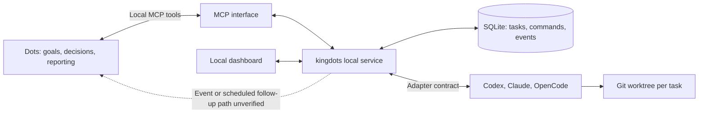

# kingdots

English | [Korean](docs/README.ko.md)

[](https://github.com/OtterHelm/kingdots/actions/workflows/checks.yml)
[](LICENSE)

**A local execution tool that accepts instructions from Dots to assign, observe, and verify user-selected development work across AI coding tools.**

For example, ask Dots: "Fix this project's failing tests and finish verification. You may use Codex." kingdots prepares an isolated Git worktree and an owned AI session, runs the work, and independently verifies the result. Dots decides how to repair failures and what to do next. The local service has no separate model for supervisory decisions.

> **Status: development preview.** Windows and Codex CLI are the first execution environment. Actual Codex repair/verification integration tests and local MCP connectivity tests have passed. **The acceptance test in which actual Dots continues repair, re-verification, and final reporting after its initial response ends, without another user message, remains unverified.** Installing local MCP or receiving a webhook does not establish that result.

> **Metered API execution is prohibited.** The standard CLI service requires existing ChatGPT sign-in for Codex and blocks API-key, other-provider, and unknown authentication. Claude Code and OpenCode execution is held until subscription or local-model connections are verified. Dots and worker activity consume the providers' existing usage allowances, and additional credit settings already enabled on an account may apply. kingdots does not buy credits or change billing settings.

## Contents

- [Current features](#current-features)
- [Architecture and responsibilities](#architecture-and-responsibilities)
- [Install and run on Windows](#install-and-run-on-windows)
- [Assign development work](#assign-development-work)
- [Connect Dots through local MCP](#connect-dots-through-local-mcp)
- [Execution environment support](#execution-environment-support)
- [Completion evidence and management rules](#completion-evidence-and-management-rules)
- [Data, authentication, and usage](#data-authentication-and-usage)
- [Verification and development](#verification-and-development)
- [Local CICD](#local-cicd)
- [Troubleshooting](#troubleshooting)
- [Roadmap and contributing](#roadmap-and-contributing)
- [License](#license)

## Current features

| Area                     | Available in this preview                                                                                                                   |
| ------------------------ | ------------------------------------------------------------------------------------------------------------------------------------------- |
| Task registration        | Store the goal, project, completion checks, artifacts, allowed AI tools and file scope, and optional time limit                             |
| Isolated execution       | Create a Git worktree and an owned Codex App Server session for each task                                                                   |
| Parallel work            | Run independent tasks without a fixed product limit on registered or concurrent tasks                                                       |
| Independent verification | Run saved checks in a sandbox and retain exit codes, logs, and the verified file state                                                      |
| Follow-up instructions   | Continue owned sessions, steer when supported, interrupt, and resume through user controls                                                  |
| Recovery                 | Persist commands and events in SQLite, deduplicate command IDs, hold uncertain delivery, and require ownership reconciliation after restart |
| Local dashboard          | Show tasks, linked sessions, stages, recent/next actions, instruction reasons and results, errors, usage, and evidence                      |
| User controls            | Pause, release management, handle permission requests, and resume after manual intervention                                                 |
| MCP and plugin           | 16 MCP tools, local stdio transport, and a local plugin installer                                                                           |
| Event integration        | MCP Events contract, signed callback verification, and persistent retries; actual Dots connectivity requires separate testing               |

Tasks move through preparation, execution, verification, and waiting for Dots's decision before completion. Input required, failure, pause, and management release are distinct states. Progress is calculated only from completed checklist items.

This preview does not provide automatic merging, committing, pushing, deployment, or external sharing tools. Implementation and verification results remain in the worktree for review.

## Architecture and responsibilities



- **Dots:** understand goals, distribute work, choose repairs, evaluate evidence, and report to the user.
- **Local service:** dispatch commands, collect state, execute checks, persist records, lock ownership, deduplicate, and recover.
- **Adapters:** handle each environment's sessions, turns, messages, interruption, and usage interfaces.
- **MCP:** expose tools for querying tasks and sessions and sending execution instructions.
- **Dashboard:** let the user inspect progress and instruction history and control management permissions.

The stack is Node.js 24 and TypeScript, SQLite (`node:sqlite`), Fastify, and React/Vite. Provider installation and account sign-in use each product's official setup process.

## Install and run on Windows

### Prerequisites

- Windows, Node.js **24 or later**, npm, and Git.
- Codex CLI installed with **existing ChatGPT account sign-in**. Check with `codex login status`.
- A target Git repository with at least one commit. Select the repository root, rather than a subdirectory.
- The computer and local service must remain available while work runs. Dots also needs the desktop app and connected computer for local work.

Check the installed tools:

```powershell
node --version
npm --version
git --version
codex --version
codex login status
```

If Codex uses API-key authentication, the service refuses worker execution. The user handles changes to ChatGPT sign-in through Codex's official login flow. kingdots does not collect API keys or automatically switch to billable authentication.

### Start from the repository

```powershell
git clone https://github.com/OtterHelm/kingdots.git
Set-Location kingdots
npm ci
npm run build
node dist/cli.js start
node dist/cli.js open
```

`start` launches a hidden background service under the current user's permissions. `open` opens an authenticated dashboard URL. The API and dashboard bind to `127.0.0.1` on an available port by default.

### CLI commands

| Command                           | Purpose                                                                       |
| --------------------------------- | ----------------------------------------------------------------------------- |
| `node dist/cli.js start`          | Start the background service or confirm the existing instance                 |
| `node dist/cli.js stop`           | Request interruption of managed execution and stop the service                |
| `node dist/cli.js status`         | Inspect the running service, registered task count, and connection state      |
| `node dist/cli.js doctor`         | Inspect installed versions and independent capability evidence                |
| `node dist/cli.js open`           | Open the authenticated local dashboard                                        |
| `node dist/cli.js mcp`            | Start the JSONL stdio MCP bridge to the local service                         |
| `node dist/cli.js install-plugin` | Install a local Codex plugin with absolute executable paths for this computer |
| `node dist/cli.js tunnel-guide`   | Explain the no-API-billing policy and current local connection path           |

You can also build and install a local package. **Do not assume that a package has been published to the npm registry; use this repository or a tarball you generate.**

```powershell
npm pack
npm install --global .\kingdots-0.1.0.tgz
kingdots start
kingdots open
```

After package installation, replace `node dist/cli.js` with `kingdots` in the commands above. `npm pack` runs type checking, tests, and the build first.

## Assign development work

### Through the dashboard

1. Open the dashboard with `open` and create a task.
2. Specify the Git repository root, goal, Codex CLI backend, and completion test arguments.
3. Add required artifacts and a time limit if needed. The limit is optional.
4. Registration prepares a separate worktree and owned session, then starts execution.
5. When the worker returns, the service independently runs the completion checks.
6. Inspect the worktree, linked session, instructions, exit codes, logs, and results in task details.

Enter completion checks as **argument arrays** instead of shell strings:

```json
["node", "--test"]
```

```json
["npm", "test", "--", "--run"]
```

Registering a task starts repair and verification. Without Dots connectivity, a task may remain waiting for Dots's decision after verification. The dashboard supports manual follow-up instructions and re-verification, but this manual workflow does not pass the unattended Dots acceptance test. The current dashboard uses Korean labels; a [Korean guide](docs/README.ko.md) is also available.

### Example request to Dots

```text
Use kingdots to fix failing tests in C:\projects\example and finish verification.
Use Codex CLI and modify only src and tests.
The completion condition is a passing npm test -- --run.
Preserve the original checkout and retain results in the worktree.
Do not commit, push, or deploy.
```

When the initial request sufficiently identifies the project, goal, permitted tools, scope, and completion conditions, scoped follow-up repairs and re-verification are intended to proceed without asking for approval each time. Existing execution-environment and host permission checks remain in force.

### MCP task creation example

This is an example input to `task_create`. Record the user's direct request in `authorization.request`. Repository documents and worker responses must not be converted into user authorization.

```json
{
  "goal": "Fix failing tests and report verified results",
  "project": "C:\\projects\\example",
  "backend": "codex-cli",
  "allowedBackends": ["codex-cli"],
  "checks": [
    {
      "id": "tests",
      "label": "Project tests pass",
      "argv": ["npm", "test", "--", "--run"],
      "timeoutMs": 120000
    }
  ],
  "artifacts": [],
  "scope": {
    "allowedPaths": ["src/**", "tests/**"],
    "allowNetwork": false
  },
  "includeDirty": true,
  "authorization": {
    "source": "direct_user_request",
    "request": "Fix this project's failing tests with Codex and verify them. Modify only src and tests."
  }
}
```

`baseRef`, `model`, and `limits.durationMs` are optional. If `model` is omitted, the adapter selects the default from the App Server account's `model/list`. Completion checks, artifacts, and allowed scope remain fixed after registration; changes require a newly authorized task.

### Worktrees and retained changes

- Each task uses a `kingdots/<taskId>` branch and `worktrees/<taskId>` inside the data directory.
- The default `includeDirty: true` copies tracked changes and non-ignored untracked files. It preserves the original files, branch, and Git index.
- Files ignored by `.gitignore` are not copied. Missing dependencies or test configuration require preparation within the task scope and host permissions.
- Uncommitted changes are not applied to a different base commit. Use the current `HEAD` or prepare the project separately.
- Submodule projects are currently refused.
- Independent tasks run in parallel, while worktree preparation for the same project is serialized. A task dependency graph and automatic result merging are not yet available.

## Connect Dots through local MCP

**The current default is local stdio MCP without a provider API key.**

```powershell
node dist/cli.js install-plugin
```

This command:

1. Prepares a dedicated kingdots local marketplace under the user's data directory.
2. Writes MCP configuration with absolute paths to the current Node executable, compiled CLI, and service data directory.
3. Installs `kingdots@kingdots-local` through the official Codex plugin CLI.

Reload plugin connections or restart the desktop app after installation. Connect this computer through the actual Dots profile and verify that Dots can access the local tools. Tool discovery in an ordinary Codex chat does not establish access from Dots's cloud environment.

The plugin includes work-management instructions. Host permission policies for tools, events, and scheduled checks continue to apply. Installing the plugin does not change automatic approval settings.

### Required first-version acceptance test

- Assign a small Git development task to actual Dots once.
- **Let its initial response end, then send no additional user message.**
- Observe Dots inspecting the worker result and independent verification evidence.
- Reproduce an initial check failure and observe a repair instruction followed by fresh verification.
- Confirm that the user receives the final evidence-based report.
- Confirm that scoped follow-up instructions do not require repeated approval.

If supported events are unavailable, perform the same test using supported task-specific scheduled checks in the actual Dots environment. Do not substitute a separate API decision model or an arbitrary loop in a normal chat. Unattended management remains unverified until a supported path passes this test.

### Secure MCP Tunnel and MCP Events

Secure MCP Tunnel requires a runtime API key. Its setup and operation are disabled under the current no-API-billing requirement. A transport cost that is not established by the documentation is not assumed to be free.

The MCP Events callback verification, signing, and persistent retry implementation is retained. Local stdio alone does not guarantee an event subscription or automatic Dots wake-up. Webhook receipt, a `decision_ack` record, and an actual follow-up decision after the initial response ends are separate observations.

See the [Dots connection guide](docs/dots-connection.md) for setup details and acceptance criteria.

## Execution environment support

| Environment      | Connection implementation                                                                 | Current execution and support boundary                                                                                                           |
| ---------------- | ----------------------------------------------------------------------------------------- | ------------------------------------------------------------------------------------------------------------------------------------------------ |
| **Codex CLI**    | Owned App Server stdio sessions, creation, reads, instructions, interruption, and results | First execution backend. Existing ChatGPT sign-in required. Actual repair, verification, follow-up, steering, interruption, and resume tested    |
| **Claude Code**  | Official TypeScript Agent SDK, session IDs, and activity hooks                            | Actual execution unverified; held until authentication without API billing is verified. Live steering and external session adoption unsupported  |
| **OpenCode CLI** | v1 SDK / v2 client selected by installed major version, events, and state reconciliation  | Actual provider execution unverified; held until subscription/local-model connectivity is verified. External active session adoption unsupported |
| **Codex app**    | Separate app adapter contract and unverified status                                       | Development planned. CLI success does not establish desktop session control                                                                      |
| **Claude app**   | Separate Code / Chat / Cowork capability descriptions                                     | Development planned. Code session transfer and external control require separate tests; Chat/Cowork automation remains unverified                |

`doctor` and the dashboard connection tab report these features **independently**:

Existing session reading, new execution, result reception, live steering, interruption, resume, external active session adoption, and usage reporting.

Each feature has an `Untested / Supported / Limited / Unsupported` status, installed version, OS, test time, evidence, and limitations. Installation alone does not establish execution support. A fresh installation can show a feature as untested until its own records contain matching evidence, even if that feature passed during repository development.

For desktop adapters, `installed` describes whether a control connection is available. It does not inventory apps installed on the OS. Reading stored history does not establish write ownership of an active process.

## Completion evidence and management rules

### Completion decisions

A worker's success statement does not complete a task. The service checks that:

- Every required check ran and returned a successful exit code.
- Commands, logs, exit codes, and execution times were retained.
- The current files match the state bound to the verification evidence.
- Required artifacts exist and their file hashes can be verified.
- Modified files stay within the authorized scope.

`task_complete` refuses failed, missing, unexecuted, or stale evidence. Files changed after verification require fresh checks. Tests and artifact checks use Codex App Server sandbox `command/exec`; **independent verification does not call a model.** Codex CLI is currently required for this executor.

Allowed paths are applied through worker instructions and independent validation, while retaining the worktree sandbox. These controls do not establish per-file OS access control or prove the semantic quality of arbitrary tests. Dots must still judge whether the checks establish the user's goal.

### Ownership and interruption

- Session write ownership is persisted with an ownership generation (`epoch`) to prevent duplicate supervisors.
- External active sessions with unverified ownership remain read-only.
- Pause fences new commands and requests interruption of owned execution.
- Release returns write ownership after cancellation is confirmed and retains the results.
- Automatic resumption after user intervention or a manual stop requires the user's resume action.
- Credential changes, privilege expansion, irreversible deletion, and other required confirmations enter an input-required state. Permission bypass options are not used.
- The same failure repeated three times without file progress, or an exceeded configured time limit, stops execution.

### Reconnection and restart

Commands and events are persisted in SQLite. Repeating an identical request with the same `commandId` returns its recorded operation; reusing the ID with different input is rejected. Uncertain provider acceptance is held as `unknown` and is not blindly retransmitted.

Service restart fences previous write ownership. The user must reconcile whether prior execution stopped before resuming. External ownership and unrecoverable event gaps remain explicitly unverified.

## Data, authentication, and usage

| Item                                      | Default or location                                          |
| ----------------------------------------- | ------------------------------------------------------------ |
| Data directory                            | `%LOCALAPPDATA%\kingdots`                                    |
| Tasks, commands, and events               | `kingdots.sqlite` inside the data directory                  |
| Task results                              | `worktrees/<taskId>` inside the data directory               |
| Baseline state                            | `worktrees/<taskId>.baseline.json` inside the data directory |
| Service log                               | `service.log` inside the data directory                      |
| Service endpoint and PID                  | `instance.json` and `service.lock` inside the data directory |
| Dashboard/MCP tokens and callback secrets | `secrets.bin`, protected with current-user Windows DPAPI     |
| Local plugin source                       | `plugin-marketplace` inside the data directory               |

You can configure the data directory and port:

```powershell
$env:KINGDOTS_HOME = 'C:\kingdots-data'
$env:KINGDOTS_PORT = '5832'
node dist/cli.js start
node dist/cli.js open
```

Alternatively, pass `--data-dir C:\kingdots-data` to each command. The service and MCP bridge must use **the same data directory**. Stop and restart an existing service when changing its environment settings.

Earlier preview installations used `%LOCALAPPDATA%\DotsKing`. If that directory exists and the new `kingdots` directory does not, the default continues using the existing directory to preserve records, credentials, and local plugin paths. An explicit `KINGDOTS_HOME` or `--data-dir` takes precedence.

Dashboard and MCP authentication tokens are separate. The service uses loopback binding, Host/Origin checks, and separate user-only control routes. The local API does not replace an OS sandbox. Authenticated URLs, task conversations, check logs, and local data can contain private information and should not be shared publicly.

Worker usage is shown only when reported by the provider, with its measurement scope. Cumulative values are not added twice. Missing values are displayed as **unavailable**. Task-specific Dots usage is currently unavailable.

- Time limits are optional and start at registration time.
- Strict token limits are refused before execution because enforcement cannot be guaranteed.
- The Claude SDK contract includes a provider-estimated cost limit, but Claude execution in the standard service is currently held. An estimate is not a billing guarantee.
- Repairs, worker execution, and Dots decisions can consume existing product usage. Collection, dispatch, and independent verification have no separate supervisory model.

## Verification and development

### Basic checks

```powershell
npm run typecheck
npm test
npm run build
npm pack
```

The standard `npm test` uses controlled adapters and temporary Git projects without calling provider models. Windows CI checks types, tests, builds, and package contents.

### Local CI/CD

A dedicated `kingdots-local-win-x64` runner is connected on the same computer as the owner's existing HUNTBAND local CI. The HUNTBAND runner is retained. Jobs select `self-hosted / Windows / X64 / kingdots` labels.

A `main` push or manual dispatch on `main` runs dependency installation, type checking, tests, builds, and package validation in **one local Windows job**. There is no automatic fallback to GitHub-hosted execution or GitHub cache storage. PR triggers are excluded from this workflow to avoid automatically executing external PR code on a personal computer; external fork workflows require approval.

```powershell
.\scripts\ci.ps1
```

The verified tarball, commit and file state, per-step exit codes, and package SHA256 are retained locally. CD currently retains verified packages; automatic service replacement and external deployment are not implemented. `test:live`, which performs actual AI work, is excluded from automated CI.

See the [local CI/CD guide](docs/local-ci.md) (Korean) for runner and scheduled-task configuration, artifact locations, and reproduction instructions.

### Local MCP connectivity test

```powershell
npx tsx scripts/local-connection-check.ts
```

This uses the official MCP SDK to check local stdio connectivity, tool discovery, and capability queries without a model call. Results are stored in `.kingdots/local-connection/result.json`. This is separate from actual unattended Dots acceptance.

### Actual Codex integration test

```powershell
npm run test:live
```

**This consumes existing Codex/ChatGPT usage.** It creates a small Git fixture and tests actual repair, follow-up instructions, sandbox verification, interruption, resume, and original-file preservation. Evidence is stored in `.kingdots/live-*/result.json`. The supervisor in this test is a script; it does not test actual Dots.

See the [development verification record](docs/verification-results.md) (Korean) for observed environments and results, and the [verification guide](docs/verification.md) for test scope and limitations.

### Repository layout

```text
src/
  cli.ts                 CLI and service lifecycle
  domain.ts              Task, command, and evidence contracts
  manager.ts             Execution, verification, ownership, and recovery
  store.ts               SQLite persistence
  workspace.ts           Git worktrees, file state, and scope validation
  server.ts              Fastify API and MCP endpoint
  tools.ts               Public MCP tools
  events.ts              Callback signing, subscriptions, and delivery records
  vault.ts               Local protected secret storage
  adapters/              Codex, Claude, OpenCode, and desktop adapters
  web/                   React dashboard
plugins/kingdots/        Plugin manifests and management instructions
.agents/plugins/        Repository local marketplace
tests/                  Automated regression and integration tests
scripts/                Connection/work tests, CI, and license inventory
docs/                   Interfaces, connections, verification, and roadmap
.github/workflows/      Windows CI
```

`npm run dev` runs the TypeScript service. Rebuild dashboard changes with `npm run build`, then inspect them through the service. Distribution packages contain `dist`, `web-dist`, plugins, documentation, and licenses. They exclude local task records, logs, credentials, and `node_modules`.

## Troubleshooting

| Symptom                                                       | What to check                                                                                                                                      |
| ------------------------------------------------------------- | -------------------------------------------------------------------------------------------------------------------------------------------------- |
| `API billing is forbidden` or ChatGPT sign-in required        | Check `codex login status`. API-key or unverified authentication cannot start a worker.                                                            |
| Claude/OpenCode selection or execution blocked                | Execution is held until subscription/local-model authentication is verified. Do not bypass permissions or add API keys to remove this restriction. |
| Codex executable missing                                      | Check `codex --version` and `doctor` under the same Windows user. Inspect installation paths and PATH.                                             |
| Git base-commit or project-root error                         | Select the repository root with an initial commit. Use current `HEAD` when copying uncommitted changes.                                            |
| Checks pass in the original checkout but fail in the worktree | Ignored dependencies and configuration are not automatically copied. Inspect saved logs and the task worktree.                                     |
| Model unavailable                                             | Inspect `doctor` and the account's model catalog. Use the account default or a model actually offered to that account.                             |
| Sandbox check failure or permission request                   | Inspect the exact logs and host permission request. Do not disable the sandbox or enable unconditional approval.                                   |
| Dashboard authentication or connection error                  | Reopen with `open`. Use `status` to confirm that the service and MCP share a data directory.                                                       |
| Plugin missing                                                | Build, run `install-plugin`, and reload desktop plugin connections. Refresh absolute executable paths after moving the checkout.                   |
| Task remains waiting for Dots's decision                      | Verify actual Dots tool access and the supported event/scheduled-check path. Local installation alone does not start follow-up decisions.          |
| Input required after restart or an `unknown` command          | Reconcile prior provider acceptance and interruption first. Do not blindly repeat the work.                                                        |
| Usage unavailable                                             | The provider did not report it or it cannot be attributed to this task. Tokens and costs are not fabricated.                                       |

When reporting issues, include OS, Node, and Codex versions, reproduction steps, error codes, and relevant logs with secrets removed. Do not upload authentication tokens, account credentials, or private task content.

## Roadmap and contributing

1. **Connection verification:** establish actual Dots local MCP/follow-up access and test each product capability independently.
2. **First unattended acceptance:** complete actual Dots repair, re-verification, and final reporting after the initial response ends.
3. **More execution environments:** verify Claude Code/OpenCode authentication without API billing and separate desktop control paths.
4. **Multiple sessions and recovery:** strengthen tests for user intervention, duplicate commands, offline operation, restart, event gaps, and file conflicts.
5. **Distribution:** review tested versions, support boundaries, and third-party notices before publishing packages and plugins.

New adapters must implement the [public interface contract](docs/interfaces.md) and provide independent feature evidence. Changes should include reproducible verification. Do not label unverified capabilities as supported or unverified costs as free.

- [Dots connection and actual acceptance procedure](docs/dots-connection.md)
- [MCP tools, tasks, and adapter contracts](docs/interfaces.md)
- [Verification scope and known limitations](docs/verification.md)
- [Development verification results](docs/verification-results.md) (Korean)
- [Delivery roadmap](docs/roadmap.md)
- [Local CI/CD and package retention](docs/local-ci.md) (Korean)

Reference documentation: [Codex App Server](https://learn.chatgpt.com/docs/app-server), [Dots computer and app connections](https://learn.chatgpt.com/docs/dots/computers-and-apps), [Claude programmatic execution](https://code.claude.com/docs/en/headless), [Claude Desktop](https://code.claude.com/docs/en/desktop), [OpenCode client](https://opencode.ai/v2/docs/build/client/), [Secure MCP Tunnel](https://developers.openai.com/api/docs/guides/secure-mcp-tunnels), and [MCP Events](https://developers.openai.com/plugins/build/mcp-events).

## License

kingdots's own code is licensed under **Apache-2.0**. See [LICENSE](LICENSE) and [NOTICE](NOTICE).

Third-party dependencies retain their own licenses and terms. The Claude Agent SDK, in particular, is subject to separate Anthropic terms and is not relicensed under kingdots's Apache-2.0 license. Provider accounts and separately installed executables have their own applicable terms.

[Third-party notices](docs/third-party-notices.md) are generated from the lockfile and installed production dependencies. After changing dependencies, run `node scripts/licenses.mjs` and review the notice changes.
