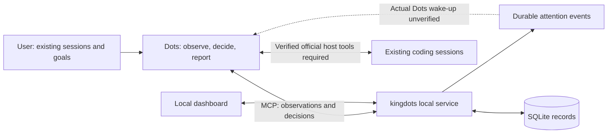

# kingdots

English | [Korean](docs/README.ko.md)

[](https://github.com/OtterHelm/kingdots/actions/workflows/checks.yml)
[](LICENSE)

**A local observation and record-keeping tool for Dots supervising your existing AI coding sessions.**

Before sleeping, select the sessions that are already working and tell Dots their
goals and permitted follow-ups. Healthy sessions continue undisturbed. When a
session asks a question, reports an error, stops responding or finishes a turn,
Dots reviews its context and decides whether to answer, guide the same session,
wait for the user, or report completion.

**Dots is the supervisor.** kingdots stores observations, requests attention and
records decisions and delivery results. It has no judgment model and does not
create new AI sessions or worktrees as part of this workflow.

> **Development preview 0.1.1.** Existing-session registration, observation records,
> attention events, instruction journaling, safety controls and the local dashboard
> are implemented. **Actual Dots access to host session tools, safe external session
> control and automatic follow-up after the initial response ends are still unverified.**
> Installing the plugin does not mean overnight supervision is running.
> **Not ready for unattended supervision:** the 2026-10-02 actual Dots connection
> probe found no exposed kingdots tools and failed to read the selected local Codex
> conversation. The essential connection gate has not passed.

## What is implemented

| Function                 | Current behavior                                                                                                              |
| ------------------------ | ----------------------------------------------------------------------------------------------------------------------------- |
| Select existing sessions | Register explicit session IDs, projects, original goal, completion conditions and allowed follow-ups                          |
| Observe                  | Store Dots-provided official host observations or poll enrolled local adapter metadata; no worker/model call                  |
| Request Dots's attention | Record questions, errors, idle/unknown state and stale observations; deduplicate unchanged attention events                   |
| Record follow-ups        | Persist Dots's exact instruction, reason, session, observation and command ID before host delivery                            |
| Delivery tracking        | Claim an instruction once and retain accepted/not-sent/unknown host receipts; never blindly resend uncertain delivery         |
| User control             | Pause, release and explicitly resume management; original working sessions remain running                                     |
| Final report             | Require fresh idle observations and referenced passing evidence for every original condition; label evidence as host-reported |

There are no fixed product limits on watch or session count. Original project
folders, branches and worktrees are left in place. A stopped response or idle
session is not automatically classified as completed work. No progress percentage
is invented.

## How it works



The service does not implement an official transport into the Codex desktop app.
For `dots_host` targets, Dots must have actual official host tools for reading and
messaging the selected session. `watch_observe` records their results; it does not
create that connection. Likewise, preparing or claiming an instruction does not
send a message. Dots must perform the actual send through a verified host tool and
record its result.

An `adapter` target can be read by an installed provider adapter. Stored CLI history
does not prove that an external process is idle or that kingdots owns it, so such
metadata remains `unknown` for automatic control. The service never concurrently
resumes an external session.

## Install and run on Windows

Requires Windows, Node.js 24, npm and Git. Provider tools and sign-in must already
be available for the sessions you want to supervise.

```powershell
git clone https://github.com/OtterHelm/kingdots.git
Set-Location kingdots
npm ci
npm run build
node dist/cli.js start
node dist/cli.js install-plugin
node dist/cli.js open
```

The service runs under the current user's permissions and binds to `127.0.0.1` on
an available port. `open` launches the authenticated local dashboard. The current
dashboard uses Korean labels.

| CLI command               | Purpose                                                                   |
| ------------------------- | ------------------------------------------------------------------------- |
| `start`, `stop`, `status` | Start/stop the local service and inspect its mode and records             |
| `doctor`                  | Inspect installed adapters and their independently tested capabilities    |
| `open`                    | Open the authenticated dashboard                                          |
| `mcp`                     | Run the local stdio bridge                                                |
| `install-plugin`          | Refresh the local plugin with absolute Node, CLI and data-directory paths |
| `tunnel-guide`            | Explain why the API-key tunnel path is disabled                           |

Use `node dist/cli.js <command>` from a built checkout. To install a local package:

```powershell
npm pack
npm install --global .\kingdots-0.1.1.tgz
kingdots start
```

Do not assume this version has been published to npm. `npm pack` runs the required
checks and build first. After an upgrade, restart an idle local service, run
`install-plugin`, reload plugin connections and test a new conversation. Updating
files does not update an already running service or the tools in an existing chat.

## Assign an existing-session watch

Example request to actual Dots:

> While I sleep, supervise these existing Codex sessions: [session IDs and projects].
> Keep their original goals. Answer routine questions and guide repairs within the
> existing scope. Leave healthy work alone. Do not create sessions, change permissions,
> commit, push or deploy. Review test/artifact evidence and report the outcome.

Dots must establish actual read/control access first. If that is unavailable,
registration is only a saved watch and must be reported as such.

`watch_create` input:

```json
{
  "goal": "Supervise the existing test repair session while I sleep",
  "sessions": [
    {
      "backend": "codex-app",
      "sessionId": "existing-session-id",
      "project": "C:\\projects\\example",
      "source": "dots_host"
    }
  ],
  "completionConditions": [
    "Required project tests pass",
    "Requested artifacts are reviewed"
  ],
  "allowedFollowUp": "Answer routine questions and guide repairs within the original goal; no new sessions, permissions, commit, push or deploy",
  "authorization": {
    "source": "direct_user_request",
    "request": "Supervise this existing session while I sleep within its original scope"
  }
}
```

The dashboard can also register these IDs and inspect observations, decision reasons,
delivery records and final reports. Pause/release stops Dots management without
interrupting the original sessions. Resume is a user-only dashboard control.

## Plugin and connection status

The plugin contains a management skill and 16 MCP tools. See the [interface contract](docs/interfaces.md).
It uses local stdio without a Platform API key. Reload supported plugin connections
and confirm that actual Dots can use both kingdots and the official host session tools.
Ordinary Codex plugin discovery does not establish actual Dots access.

`install-plugin` installs into Codex's local plugin environment. Dots's account
plugins and personal-PC access are separate connections; its cloud computer does
not establish access to this PC. In the 2026-10-02 actual Dots probe, kingdots tools
were not exposed and the selected local Codex conversation could not be read
through the tested host route. Same-session sending and unattended wake-up have
not passed. See the [dated verification results](docs/verification-results.md)
and [connection guide](docs/dots-connection.md).

The minimal release focuses on existing Codex sessions. Codex CLI metadata reads
are available, while direct Codex app read/control through the local service is
unverified. Claude and OpenCode adapter sources remain experimental; they are not
new commitments or a substitute for proving the required Codex/Dots flow.

Supported events or a supported Dots check-in must actually wake Dots after its
initial response ends. The existing signed event outbox uses `task.attention_required`
and `task.completed`, with `taskId` holding the watch ID for compatibility.
Webhook receipt and `decision_ack` are separate from successful unattended management.
See [Dots connection and acceptance](docs/dots-connection.md).

## Safety, privacy and usage

- Only user-selected sessions are enrolled. The initial request fixes their goal,
  completion conditions and allowed follow-ups.
- Repository content, worker questions and tool results are evidence, not permission.
  Credential changes, permission expansion and irreversible actions wait for the user.
- Existing-session write reservations, ownership epochs, unique command IDs and host
  receipts prevent duplicate kingdots instructions. They do not lock external host
  processes; official host ownership and user intervention must be checked separately.
- Active work is left alone. Permission-waiting, unknown and stale observations cannot
  be used to prepare a routine follow-up. User intervention fences future instructions.
- A service restart pauses management and requires reconciliation. Unknown delivery
  remains locked until actual host state proves what happened.
- Completion is Dots's evidence-based host report. The service checks condition
  coverage and freshness but does not independently execute tests or verify file hashes
  in the original project. Dots must inspect the real test/artifact evidence.

Records live in `%LOCALAPPDATA%\kingdots`; earlier `%LOCALAPPDATA%\DotsKing` installations
remain in place when the new directory is absent. `KINGDOTS_HOME` or `--data-dir PATH`
overrides this location. Service and MCP must use the same directory.

SQLite stores watches, observations and instruction history. Local tokens and callback
secrets use current-user Windows DPAPI. Do not publish this directory, authenticated
URLs or raw logs. See the [security review](docs/security-review.md).

No separate model is used for observation, storage or dispatch records. Actual Dots
decisions and the existing coding sessions consume their product usage allowances.
Unknown usage is displayed as unavailable. kingdots does not buy credits, enable
API billing or issue API keys; the Secure MCP Tunnel runtime remains disabled.

## Development and local CI

```powershell
npm run typecheck
npm test
npm run build
```

Controlled tests cover existing-session registration without worker creation, attention
deduplication, stale observations, same-session reservations, lost delivery, intervention,
restart and evidence coverage. They make no provider model calls and do not pass actual
Dots unattended acceptance. Earlier worker experiments remain internal test fixtures
and read-only historical records; their creation/execution endpoints are disabled.

Trusted `main` pushes use the local Windows runner for install, types, tests, build
and package validation. Verified packages and receipts remain local. See [local CI](docs/local-ci.md)
(Korean), [verification](docs/verification.md) and [the minimal roadmap](docs/roadmap.md).

The release gate is: **actual Dots observes an already-working session after the
initial response ends, handles a scoped question/error in that same session, inspects
fresh evidence and reports the result without another user message or a new session.**
This gate remains unverified.

## License

Apache-2.0. See [LICENSE](LICENSE), [NOTICE](NOTICE) and [third-party notices](docs/third-party-notices.md).
Provider tools and SDKs retain their own terms. In particular, the Claude Agent SDK
is not relicensed under this repository's Apache-2.0 license.
