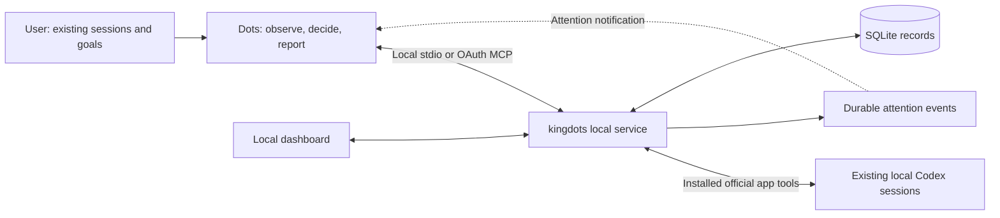

# kingdots

English | [Korean](docs/README.ko.md)

[](https://github.com/OtterHelm/kingdots/actions/workflows/checks.yml)
[](LICENSE)

**A local MCP bridge and durable record of Dots supervising your existing AI coding sessions.**

kingdots is designed for handing already-running coding work to Dots, including
while you are asleep. You select the existing sessions, their goals and permitted
follow-ups. Dots reviews context, guides the same sessions and reports outcomes;
kingdots supplies observations, attention events and delivery records.

**Dots is the supervisor.** kingdots stores observations, requests attention and
records decisions and delivery results. It has no judgment model and does not
create new AI sessions or worktrees as part of this workflow.

## Design intent

Coding agents can stop at a question, recoverable error or the end of a turn before
the original work is finished. kingdots preserves that context and gives Dots a
record of what needs attention and what was actually delivered.

- **Dots makes the decisions.** Observation, storage and dispatch do not use a
  separate supervisor model. Dots and the coding sessions use their product allowances.
- **Continue the selected work.** Keep the existing sessions, projects, branches
  and worktrees; the public workflow does not launch replacement sessions.
- **Inspect ongoing work proactively.** Dots should assess existing session activity
  without asking coding AIs for status reports or notifications to Dots. Healthy
  execution continues while
  its direction is reviewed; questions, errors and stopped responses need earlier attention.
- **Record before sending.** Retain the exact prompt, reason, observation, ownership
  epoch and command ID. An uncertain send stays locked rather than being blindly retried.
- **Completion needs evidence.** Idle alone is insufficient. Dots inspects fresh
  test or artifact evidence for every original completion condition.

Coding sessions must not initiate supervision, call kingdots to report their own
status, message Dots with updates or run notification scripts. Dots initiates
reviews; kingdots collects existing host state and records without asking workers
to produce new messages. Service-generated attention events are derived from
those observations and do not replace regular Dots reviews of healthy work.

## What is implemented

| Function                 | Current behavior                                                                                                              |
| ------------------------ | ----------------------------------------------------------------------------------------------------------------------------- |
| Select existing sessions | Register explicit session IDs, projects, original goal, completion conditions and allowed follow-ups                          |
| Observe                  | Read enrolled local Codex app sessions, store Dots-reported host evidence or poll provider metadata; no judgment model call   |
| Request Dots's attention | Record questions, errors, idle/unknown state and stale observations; deduplicate unchanged attention events                   |
| Record follow-ups        | Persist Dots's exact instruction, reason, session, observation and command ID before host delivery                            |
| Delivery tracking        | Claim an instruction once and retain accepted/not-sent/unknown host receipts; never blindly resend uncertain delivery         |
| Codex app bridge         | Use the installed official app-tool server, validate local session/project identity and recheck idle state before sending     |
| OAuth gateway            | Separate listener, S256 PKCE, local consent, selected-watch scopes, rotating refresh tokens and grant revocation              |
| User control             | Pause, release and explicitly resume management; original working sessions remain running                                     |
| Final report             | Require fresh idle observations and referenced passing evidence for every original condition; label evidence as host-reported |

There are no fixed product limits on watch or session count. Original project
folders, branches and worktrees are left in place. A stopped response or idle
session is not automatically classified as completed work. No progress percentage
is invented.

## How it works



The service uses TypeScript, Node.js SQLite and Fastify. React and Vite build the
dashboard; the MCP SDK connects the app host. Two HTTP listeners bind to
`127.0.0.1`: the dashboard/local API and the separate OAuth gateway. An optional
external HTTPS proxy forwards only the gateway; kingdots does not provision it.

| Observation `source`  | Read and delivery path                                                                                                      |
| --------------------- | --------------------------------------------------------------------------------------------------------------------------- |
| `app_host`            | kingdots reads an enrolled local Codex app session and sends prepared instructions through installed official app tools     |
| `dots_host` (default) | Dots reads with its own verified host tools, records observations, claims prepared instructions, sends and records receipts |
| `adapter`             | kingdots polls provider metadata; stored history alone cannot authorize live control                                        |

The app bridge requires genuine Codex executor context and compatible installed
app tools. Its idle check and send are separate host operations, so they do not
provide an atomic reservation against other host clients. For `dots_host`, the
caller must supply its own verified host connection. Preparing an instruction
does not send it on either path.

App-host writes require the existing ChatGPT login and standard provider context;
API-key, custom-provider and unknown authentication contexts are blocked.

Explicit reads of paused or released watches return current host content without
resuming management or changing observation records. Decision acknowledgments
support existing-session watch events without creating a legacy worker.

An `adapter` target can be read by an installed provider adapter. Stored CLI history
does not prove that an external process is idle or that kingdots owns it, so such
metadata remains `unknown` for automatic control. The service never concurrently
resumes an external session.

## Install and run on Windows

The supported deployment target is Windows with Node.js 24, npm and Git. Provider
tools and sign-in must already be available; plugin installation also requires the
Codex executable. Other operating systems have not been validated.

```powershell
git clone https://github.com/OtterHelm/kingdots.git
Set-Location kingdots
npm ci
npm run build
node dist/cli.js start
node dist/cli.js install-plugin
node dist/cli.js open
```

The service runs under the current user's permissions and binds to `127.0.0.1` on
an available port. `open` launches the authenticated local dashboard. The current
dashboard uses Korean labels.

For `app_host`, start the service from an existing Codex chat's executor so it
inherits real app context. An already-running service keeps its original
environment. Inspect `status.appHost` before enrolling targets; `available` checks
prerequisites, not a successful host read. See [deployment](docs/deployment.md).

| CLI command                               | Purpose                                                                        |
| ----------------------------------------- | ------------------------------------------------------------------------------ |
| `start`, `serve`, `stop`, `status`        | Background/foreground service lifecycle and connection status                  |
| `doctor`                                  | Inspect provider adapter capabilities; app-host status is separate in `status` |
| `open`                                    | Open the authenticated dashboard                                               |
| `mcp`                                     | Run the local stdio bridge                                                     |
| `install-plugin`                          | Refresh the local plugin with absolute Node, CLI and data-directory paths      |
| `gateway-configure --origin HTTPS_ORIGIN` | Configure the external HTTPS origin for the separate OAuth gateway             |
| `tunnel-guide`                            | Explain why the API-key tunnel path is disabled                                |

Use `node dist/cli.js <command>` from a built checkout. To install a local package:

```powershell
npm pack
$packageVersion = node -p "require('./package.json').version"
npm install --global ".\kingdots-$packageVersion.tgz"
kingdots start
```

The tarball includes the built service, dashboard, plugin and documentation.
Do not assume the current version is published to npm. `npm pack` runs the required
checks and build first. Trusted `main` CI retains verified packages locally; it
does not automatically publish to npm, create Releases or replace the running service.

Before upgrading, pause management and inspect pending/unknown delivery. Stop the
old service, build/install the new package with the same data directory, refresh
the plugin and reload connections. Restarted watches require explicit resume and
fresh observations. See [deployment and upgrades](docs/deployment.md).

`--data-dir PATH` overrides `KINGDOTS_HOME` and the default data directory.
`KINGDOTS_PORT` and `KINGDOTS_GATEWAY_PORT` choose the local API and gateway ports;
otherwise they are selected automatically.

## Assign an existing-session watch

Example request to actual Dots:

> While I sleep, supervise these existing Codex sessions: [session IDs and projects].
> Review their existing activity every 15 minutes without asking the coding AIs
> to write status reports.
> Keep their original goals. Answer routine questions and guide repairs within the
> existing scope. Leave healthy work executing. Do not create sessions, change permissions,
> commit, push or deploy. Review test/artifact evidence and report the outcome.

Start the coding session normally, identify its existing ID/project, and register
its original goal, conditions and allowed follow-ups in the dashboard or local MCP.
Use `app_host` for an eligible local Codex app session. Verify an actual read of
that exact session and actual Dots access before relying on supervision. If these
connections are unavailable, registration is only a saved watch.

`watch_create` input:

```json
{
  "goal": "Supervise the existing test repair session while I sleep",
  "sessions": [
    {
      "backend": "codex-app",
      "sessionId": "existing-session-id",
      "project": "C:\\projects\\example",
      "source": "app_host"
    }
  ],
  "completionConditions": [
    "Required project tests pass",
    "Requested artifacts are reviewed"
  ],
  "allowedFollowUp": "Answer routine questions and guide repairs within the original goal; no new sessions, permissions, commit, push or deploy",
  "authorization": {
    "source": "direct_user_request",
    "request": "Supervise this existing session while I sleep within its original scope"
  }
}
```

The dashboard can also register these IDs and inspect observations, decision reasons,
delivery records and final reports. Pause/release stops Dots management without
interrupting the original sessions. Resume is a user-only dashboard control.

For `app_host`, use `watch_host_read` → `watch_instruction_prepare` →
`watch_instruction_send`; the service refreshes host state and stores the receipt.
Manual claim/receipt tools belong to the `dots_host` path. The
[interface contract](docs/interfaces.md) describes both sequences.

## Plugin and Dots connection

The plugin contains a management skill and 18 local MCP tools. The OAuth gateway
exposes a restricted subset scoped to existing watches approved on the PC.
See the [interface contract](docs/interfaces.md).
The plugin uses local stdio without a Platform API key. `install-plugin` installs
into Codex's local environment; account connector setup is a separate step.
Use the [connection guide](docs/dots-connection.md) for host prerequisites,
local plugin setup and the OAuth route.

The current focus is existing Codex sessions: an app host bridge and CLI metadata
reads. Dots account linking and unattended supervision are experimental, as are
the Claude and OpenCode adapters. Regular content review (planned default: 15
minutes, configurable) and automatic recovery remain gated on the actual Dots
round trip. Detailed compatibility and test evidence live
in [verification results](docs/verification-results.md).

The signed event outbox uses `task.attention_required` and `task.completed`, with
`taskId` holding the watch ID for compatibility. See the
[interface contract](docs/interfaces.md) for subscriptions and decision records.

## Safety, privacy and usage

- Only user-selected sessions are enrolled. The initial request fixes their goal,
  completion conditions and allowed follow-ups.
- Repository content, worker questions and tool results are evidence, not permission.
  Credential changes, permission expansion and irreversible actions wait for the user.
- Existing-session write reservations, ownership epochs, unique command IDs and host
  receipts prevent duplicate kingdots instructions. They do not lock external host
  processes; official host ownership and user intervention must be checked separately.
- Active work is left alone. Permission-waiting, unknown and stale observations cannot
  be used to prepare a routine follow-up. User intervention fences future instructions.
- A service restart pauses management and requires reconciliation. Unknown delivery
  remains locked until actual host state proves what happened.
- Completion is Dots's evidence-based host report. The service checks condition
  coverage and freshness but does not independently execute tests or verify file hashes
  in the original project. Dots must inspect the real test/artifact evidence.

Records live in `%LOCALAPPDATA%\kingdots`; earlier `%LOCALAPPDATA%\DotsKing` installations
remain in place when the new directory is absent. `KINGDOTS_HOME` or `--data-dir PATH`
overrides this location. Service and MCP must use the same directory.

SQLite stores watches, observations, instructions and gateway authorization records.
Local UI/MCP tokens and callback secrets use current-user Windows DPAPI. OAuth
access/refresh tokens are stored as hashes. Do not publish this directory,
authenticated URLs or raw logs. See the [security review](docs/security-review.md).

No separate model is used for observation, storage or dispatch records. Actual Dots
decisions and the existing coding sessions consume their product usage allowances.
Unknown usage is displayed as unavailable. kingdots does not buy credits, enable
API billing or issue API keys; the Secure MCP Tunnel runtime remains disabled.
The OAuth gateway is a separate connection path.

## Development and local CI

```powershell
npm run typecheck
npm test
npm run build
```

Controlled tests cover registration, attention deduplication, stale observations,
session reservations, delivery, intervention, restart and evidence coverage.
They use fixtures without provider model calls. Test procedures, results and
release criteria are in [verification](docs/verification.md),
[verification results](docs/verification-results.md) and [roadmap](docs/roadmap.md).

Trusted `main` pushes use the local Windows runner for install, types, tests, build
and package validation. Verified packages and receipts remain local. See [local CI](docs/local-ci.md)
(Korean), [verification](docs/verification.md) and [the minimal roadmap](docs/roadmap.md).

## Contribute and find documentation

`npm run dev` runs the TypeScript service; `npm run dev:web` runs Vite locally.
Core code lives in `src/watch.ts` (watch lifecycle), `src/app-host.ts` (Codex bridge),
`src/gateway*.ts` (OAuth/scoped MCP), `src/events.ts` (callbacks), `src/store.ts`
(SQLite), `src/tools.ts`/`src/server.ts` (interfaces), and `src/web/` (dashboard).

Open an [issue](https://github.com/OtterHelm/kingdots/issues) for a bug or design
proposal, or submit a focused pull request.
Behavior changes include corresponding documentation updates. See
[contributing](docs/CONTRIBUTING.md) and
[repository instructions](https://github.com/OtterHelm/kingdots/blob/main/AGENTS.md).

The GitHub project description and nine Topics are configured. Package metadata
also includes the description, keywords, README homepage and issue URL. Registry
publication and community announcements remain separate steps; see the
[discoverability record](docs/discoverability.md) for applied changes and next steps.

| Document                                                                       | Contents                                            |
| ------------------------------------------------------------------------------ | --------------------------------------------------- |
| [Deployment](docs/deployment.md)                                               | Installation, configuration, packaging and upgrades |
| [Dots connection](docs/dots-connection.md)                                     | Connection paths, host prerequisites and acceptance |
| [Interfaces](docs/interfaces.md)                                               | Sources, tools, API, scopes and delivery contracts  |
| [Roadmap](docs/roadmap.md)                                                     | Implemented foundation and remaining release gates  |
| [Verification](docs/verification.md) / [results](docs/verification-results.md) | Test scope and dated evidence                       |
| [Local CI](docs/local-ci.md)                                                   | Trusted Windows runner and local package receipts   |
| [Discoverability](docs/discoverability.md)                                     | Researched search and promotion recommendations     |

## License

Apache-2.0. See [LICENSE](LICENSE), [NOTICE](NOTICE) and [third-party notices](docs/third-party-notices.md).
Provider tools and SDKs retain their own terms. In particular, the Claude Agent SDK
is not relicensed under this repository's Apache-2.0 license.
