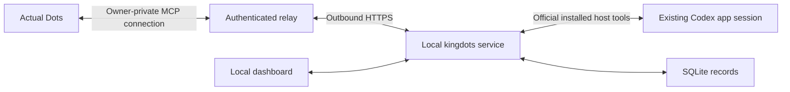

# kingdots

[한국어](docs/README.ko.md)

kingdots lets **Dots inspect coding sessions the user has already started**. It collects existing records, retains judgments and delivery evidence, and displays them in a local dashboard. Coding AIs do not write supervisor reports or notify Dots.

Dots makes decisions. The PC service handles collection, storage, transport and permission checks without a separate supervisor model. This development preview focuses on existing Windows Codex app sessions.

## How it works



Dots requests a read. The PC retrieves that request, reads the selected original conversation through installed official tools, and returns existing records. Dots can return a correlated no-action judgment; the same service stores it in the same SQLite database. Polling the transport and storing receipts do not make AI decisions or wake Dots.

The service and dashboard stay on loopback. The private relay connects the account without exposing the PC API. The current path needs one Dots account plugin and one PC service; an additional Codex-local management plugin is unnecessary.

## Functions and support

- Register existing sessions with their original goals, completion conditions and allowed follow-ups.
- Inspect existing records and metadata; keep ordinary running observations quiet.
- Store scoped instructions, receipts, ownership epochs and uncertain results without duplicate dispatch.
- Pause, explicitly resume or release management while preserving original coding sessions.
- View observations, delivery reasons, connection health and returned reviews in the dashboard.
- Preserve old task records and import prior connection evidence as history without activating management.

Provider adapters expose metadata discovery, list, read and close only. Worker creation,
provider prompts, approval handlers and worktree creation code have been removed.
Stored idle/not-loaded metadata does not establish an external session's live idle state
or ownership. Existing Codex app-host follow-up tools retain their separate permission boundary.

| Target | Current boundary |
| ------ | ---------------- |
| Codex app | Existing local session reads through official host tools. The private plugin exposes inspection and no-action review only. Safe live instruction delivery remains unverified. |
| Codex CLI | Stored metadata through App Server; external session ownership and control remain unverified. |
| Claude Code | Stored metadata through Agent SDK; external session ownership and control remain unverified. |
| Claude app | External Code, Chat and Cowork observation/control remain unverified. |
| OpenCode CLI | Experimental version-dependent metadata adapter; existing-session control remains unverified. |

Bounded actual Dots reads, judgment return and one-time checks after the initial response passed on the preceding connection implementation. The consolidated runtime has controlled regression coverage; an actual Dots retest is pending. Configurable regular reviews, safe live intervention, five-minute response targets, unknown-delivery recovery and overnight supervision remain unverified. A dashboard or authenticated account is not automatic-management acceptance. See [verification results](docs/verification-results.md).

## Install and run

Use Windows, Node.js 24, npm, Git and an existing authenticated Codex app installation. Other operating systems have not been validated.

```powershell
git clone https://github.com/OtterHelm/kingdots.git
Set-Location kingdots
npm ci
npm run build
node dist/cli.js start
node dist/cli.js open
```

Each user installs and runs kingdots on their own PC with the prerequisites above. The service uses the permissions of the OS account that launched it. It binds to `127.0.0.1` (localhost, that PC itself) and chooses an available port. `open` launches that installation's authenticated dashboard, which currently uses Korean labels.

For app_host, start the service from an existing Codex chat's executor to inherit genuine app context. A running service keeps its original environment. Inspect status.appHost; available checks prerequisites, not a successful read. See [deployment](docs/deployment.md).

| CLI command | Purpose |
| ----------- | ------- |
| start, serve, stop, status | Background/foreground service lifecycle and status |
| doctor | Adapter capabilities; app-host prerequisites appear separately in status |
| open | Authenticated dashboard |
| mcp | Local stdio diagnostics; does not connect Dots by itself |
| relay-configure | Read connection settings from protected stdin while the service is stopped |

Use node dist/cli.js COMMAND from a built checkout. To install a local package:

```powershell
npm pack
$packageVersion = node -p "require('./package.json').version"
npm install --global ".\kingdots-$packageVersion.tgz"
kingdots start
```

The tarball includes the built service, dashboard, relay deployment source and documentation. It excludes fixtures, temporary runners and credentials. Do not assume this version is published to npm. Packaging validates and builds first; trusted main CI retains verified packages locally without automatically publishing or replacing the service.

Before upgrading, pause management and inspect pending/unknown delivery. Stop the old service, build/install with the same data directory, and restart. Paused watches remain paused. Prior connection journals are imported once as unbound history. Explicit connection configuration does not resume a watch. See [upgrades](docs/deployment.md).

The --data-dir PATH option overrides KINGDOTS_HOME and the default location. KINGDOTS_PORT selects the local listener port; otherwise an available port is chosen. There is no separate PC OAuth gateway listener.

## Register and inspect existing work

Register the original goal, existing session ID/project, conditions and allowed follow-ups in the dashboard or local MCP. Use app_host for an eligible existing local Codex conversation and confirm an actual read of that exact target.

```json
{
  "goal": "Observe the existing test repair session",
  "sessions": [{
    "backend": "codex-app",
    "sessionId": "existing-session-id",
    "project": "C:\\projects\\example",
    "source": "app_host"
  }],
  "completionConditions": ["Required tests pass", "Requested artifacts reviewed"],
  "allowedFollowUp": "Routine questions within the original goal; no new sessions, permissions, commit, push or deploy",
  "authorization": {
    "source": "direct_user_request",
    "request": "Observe this existing session within its original scope"
  }
}
```

Pause/release fences local management without interrupting the original session. Resume is a user-only dashboard control. Explicit inspection of a paused watch does not change its observations, instructions or control state. Released watches are unavailable to the relay.

The local MCP retains its existing scoped follow-up journal and host delivery tools. The private plugin does not expose them, and their availability does not prove actual Dots coding control. See the [18 local tools and their boundaries](docs/interfaces.md).

## Plugin and Dots connection

One owner-private account plugin exposes inspect_existing_session and record_no_action_review, using the [relay source](relay/README.md). Sites supplies account OAuth; the PC uses its provisioned service credential and a device pairing token. No public PC address or model API key is required.

Configure the trusted relay origin and one registered session while the PC service is stopped. Settings are read from protected stdin and credentials stay in the local vault. The [connection guide](docs/dots-connection.md) covers deployment, pairing and limits. Reuse the existing private deployment and plugin.

Example assignment to actual Dots after connection:

> Use kingdots to inspect my selected existing session. Read existing records and record a no-action review if no intervention is needed. Do not ask the coding AI to report, create another session, approve permissions or send an unsupported instruction.

The PC retrieves requests initiated by Dots; it sends no worker report or Dots notification. Ongoing review scheduling is a separate acceptance gate. The signed local event outbox is retained; event delivery alone does not prove Dots woke or made a judgment.

## Safety, privacy and usage

- The user selects sessions and scope. Repository content, worker questions and tool results are evidence, not permission.
- Credentials, permission expansion and irreversible actions require the user. Existing host permission checks remain.
- Local UI and MCP use separate tokens checked against the router's matched route, including encoded aliases. Streamed relay requests/responses are stopped when their byte limit is exceeded.
- Epochs, reservations, command IDs and receipts prevent duplicate kingdots instructions; they do not lock unrelated host processes.
- Active, permission-waiting, unknown, stale and user-intervened states fence follow-ups. Restart pauses management.
- Uncertain delivery is held. An inspection result with an unknown acknowledgment is not automatically resent; recovery needs actual acceptance evidence.
- Completion requires fresh host-reported conditions and references. The service does not independently execute tests or verify original file hashes.

Records live in %LOCALAPPDATA%\kingdots. Earlier %LOCALAPPDATA%\DotsKing installations remain in place when the newer directory is absent. KINGDOTS_HOME or --data-dir PATH overrides the location. Service and diagnostics must use the same directory.

kingdots.sqlite stores watches, observations, instructions, relay jobs and returned reviews. secrets.bin protects UI/MCP tokens, callback and relay credentials with current-user Windows DPAPI. Prior sidecar files remain for recovery but are not runtime databases. Imported history has no current session authority.

Recent conversation records cross the owner-private hosting boundary. After 15 minutes, snapshots and decisions expire and their payloads are removed on the next request; command-ID tombstones prevent re-execution. Session/project identifiers are masked, which cannot guarantee removal of every secret embedded in text. Do not publish credentials, local records, authenticated URLs or logs. See [security review](docs/security-review.md).

Collection, storage and transport call no separate model. Actual Dots decisions and coding sessions consume existing product allowances. Unknown usage is not estimated. kingdots does not create API keys, buy credits or enable model API billing. Hosting prerequisites and applicable terms must be checked separately; the software does not promise unlimited free infrastructure.

## Development and local CI

```powershell
npm run typecheck
npm test
npm run build
```

Meaningful regression tests and CI remain development tools. They cover existing-session fencing, authentication, receipts, replay protection, migration and relay correlation without provider model calls. Prototype runners and old worker-creation tests have been removed. See [verification](docs/verification.md), [results](docs/verification-results.md) and [roadmap](docs/roadmap.md).

Trusted main pushes use the Windows runner for install, dependency audits of both lockfiles, types, tests, build and package validation. Packages exclude secrets and fixtures; clean builds prevent deleted modules surviving in dist. Verified artifacts and receipts remain local. See [local CI](docs/local-ci.md).

## Contribute and find documentation

npm run dev runs the TypeScript service; npm run dev:web runs Vite. Core files are src/watch.ts (lifecycle), src/app-host.ts (host bridge), src/relay.ts and relay/worker/relay.js (transport), src/events.ts (callbacks), src/store.ts (SQLite), src/tools.ts and src/server.ts (interfaces), and src/web/ (dashboard).

Open an [issue](https://github.com/OtterHelm/kingdots/issues) or focused PR. Behavior changes include documentation updates. See [contributing](docs/CONTRIBUTING.md) and [repository instructions](https://github.com/OtterHelm/kingdots/blob/main/AGENTS.md).

| Document | Contents |
| -------- | -------- |
| [Deployment](docs/deployment.md) | Installation, configuration, packaging and upgrades |
| [Dots connection](docs/dots-connection.md) | Connection, prerequisites and limits |
| [Interfaces](docs/interfaces.md) | Sources, tools, routes and contracts |
| [Roadmap](docs/roadmap.md) | Current scope and acceptance gates |
| [Verification](docs/verification.md) / [results](docs/verification-results.md) | Checks and dated evidence |
| [Local CI](docs/local-ci.md) | Windows runner and local receipts |
| [Discoverability](docs/discoverability.md) | Search and promotion records |

## License

Apache-2.0. See [LICENSE](LICENSE), [NOTICE](NOTICE) and [third-party notices](docs/third-party-notices.md). Provider tools and SDKs retain their own terms. The Claude Agent SDK is not relicensed under this repository's Apache-2.0 license.
