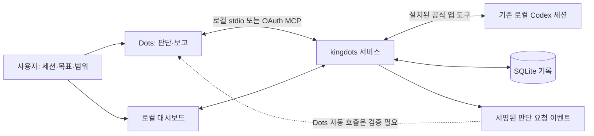

# kingdots

[English](../README.md) | 한국어

[](https://github.com/OtterHelm/kingdots/actions/workflows/checks.yml)
[](../LICENSE)

**Dots가 기존 AI 코딩 세션을 관리하도록 MCP로 연결하고, 관찰·판단·전달 결과를 보관하는 로컬 도구입니다.**

자기 전에 기존 세션과 목표·허용 범위를 Dots에 맡깁니다. 정상 진행 중인 세션은 그대로 두고, 질문·오류·응답 종료·연결 문제를 확인하면 Dots가 기존 맥락을 읽고 같은 세션에 후속 지시하거나 사용자 입력을 기다립니다. kingdots는 관찰·지시·전달 결과를 기록하며 별도의 판단용 AI, 새 세션 또는 worktree를 만들지 않습니다.

> **개발 프리뷰.** 기존 세션 감시, 대시보드, 로컬 MCP, Codex 앱 호스트 연결과 OAuth 게이트웨이를 구현했습니다. 실제 Dots 연결과 최초 응답 종료 후 자동 관리는 아직 미검증입니다. 설치나 등록만으로 밤새 관리가 시작되지는 않습니다. [날짜별 검증 결과](verification-results.md)에서 시험 범위를 확인하세요.

**현재 버전은 0.1.2 개발 프리뷰입니다.** [2026-10-03 검증 기록](verification-results.md)에서는 자동 테스트 55개 통과, Windows의 기존 Codex 앱 대화 조회, 실행 중인 세션에 대한 추가 지시 차단을 확인했습니다. 실제 대기 세션에 지시를 보내는 시험, Dots의 도구 접근, 최초 응답 종료 후 자동 관리는 아직 미검증입니다.

## 설계 의도

코딩 에이전트는 원래 목표를 끝내기 전에 질문, 복구 가능한 오류 또는 응답 종료 지점에서 멈출 수 있습니다. kingdots는 그 작업의 맥락을 유지하고 Dots가 어디에 개입해야 하는지, 어떤 지시가 실제로 전달됐는지 확인할 수 있는 기록을 제공합니다.

- **판단은 Dots가 합니다.** 관찰·저장·전달에 별도의 감독 모델을 호출하지 않습니다. Dots와 기존 작업 세션은 각 제품의 사용량을 사용합니다.
- **선택한 기존 작업을 이어갑니다.** 원래 세션·프로젝트·브랜치·worktree를 유지하고 대체 세션을 생성하지 않습니다.
- **정상 진행 중인 작업은 그대로 둡니다.** 변경 없는 정상 상태는 조용히 관찰하고 질문·실패·응답 종료·연결 불가·오래된 관찰에 판단을 요청합니다.
- **전달 전에 기록합니다.** 정확한 지시문·이유·관찰·소유권 세대·고유 명령 ID를 보관하고 전달 여부가 불명확하면 예약을 유지합니다.
- **완료는 근거로 판단합니다.** 대기 상태만으로 끝났다고 보지 않고 최초 완료 조건마다 최신 테스트·산출물 근거를 확인합니다.

## 기술적 기능과 구성

| 기능             | 구현 내용                                                                 |
| ---------------- | ------------------------------------------------------------------------- |
| 기존 세션 감시   | 세션·프로젝트 ID, 목표, 완료 조건과 허용 후속 지시 등록                   |
| 관찰             | 공식 Codex 앱 조회, Dots의 호스트 관찰 보고, 제공자 메타데이터 조회       |
| 판단 요청 이벤트 | SQLite 영속 기록, 중복 방지, 서명된 callback과 재시도 내역                |
| 후속 지시        | 지시 준비 기록, 세션별 예약, 한 번의 전달과 호스트 수신 결과              |
| Codex 앱 연결    | 설치된 공식 앱 도구 서버, 로컬 세션·프로젝트 검사, 전송 직전 상태 재확인  |
| OAuth 게이트웨이 | 별도 listener, S256 PKCE, 로컬 동의, 감시별 권한, refresh token 회전·해제 |
| 사용자 제어      | 관리 중단·해제·명시적 재개, 사용자 개입·서비스 재시작 뒤 후속 지시 차단   |
| 완료 보고        | 최신 대기 상태 관찰과 최초 완료 조건별 통과 근거 확인                     |

감시나 등록 세션 수에 고정된 제품 제한을 두지 않습니다. 원래 폴더·브랜치·worktree를 유지하며 응답 종료나 대기 상태만으로 작업 완료를 선언하지 않습니다. 확인하지 않은 진행률을 만들어 표시하지 않습니다.

서비스는 TypeScript, Node.js SQLite와 Fastify, 대시보드는 React와 Vite를 사용합니다. MCP SDK로 설치된 앱 도구에 연결하고 CLI는 로컬 stdio를 제공합니다. 대시보드·로컬 API와 OAuth 게이트웨이는 `127.0.0.1`의 별도 포트에 바인딩합니다. 외부 연결에는 게이트웨이만 전달하는 HTTPS proxy를 별도로 준비해야 하며 kingdots가 proxy나 클라우드 worker를 배포하지는 않습니다.



| 관찰 `source`        | 조회·전달 경로                                                                    |
| -------------------- | --------------------------------------------------------------------------------- |
| `app_host`           | kingdots가 등록한 로컬 Codex 앱 세션을 공식 앱 도구로 조회하고 준비된 지시를 전달 |
| `dots_host` (기본값) | Dots가 자체 호스트 도구로 조회하고 관찰·claim·직접 전송·수신 결과를 기록          |
| `adapter`            | 제공자 메타데이터 조회. 저장 이력만으로 실시간 세션 제어를 허용하지 않음          |

`app_host`는 `backend: codex-app`인 기존 로컬 세션에만 사용할 수 있습니다. 지시를 준비한 뒤에도 전송 직전에 같은 세션이 대기 상태이고 준비 당시의 상태와 일치하는지 다시 확인합니다. 정확한 관찰·전달 계약은 [인터페이스](interfaces.md)에 설명합니다.

## 설치와 갱신

지원 배포 환경은 Windows PC, Node.js 24, npm과 Git입니다. 관리할 세션과 제공자 로그인은 기존 상태를 사용하고 플러그인 설치에는 Codex 실행 파일도 필요합니다. 다른 운영체제는 검증하지 않았습니다.

```powershell
git clone https://github.com/OtterHelm/kingdots.git
Set-Location kingdots
npm ci
npm run build
node dist/cli.js start
node dist/cli.js install-plugin
node dist/cli.js open
```

`start`는 현재 사용자의 권한으로 백그라운드 서비스를 시작하고 `open`은 인증된 한국어 대시보드를 엽니다. `app_host`를 사용하려면 기존 Codex 대화에서 명령을 실행하는 환경(executor)을 통해 서비스를 시작해야 합니다. 이 환경이 제공하는 실제 앱 연결 정보를 상속하며 이미 실행 중인 서비스의 환경은 바뀌지 않습니다. `status.appHost`의 `available`은 전제 조건 확인이며 실제 조회·Dots 연결 성공을 뜻하지 않습니다. 자세한 준비·재시작 절차는 [배포 문서](deployment.md)를 참고하세요.

| CLI 명령                                  | 용도                                                             |
| ----------------------------------------- | ---------------------------------------------------------------- |
| `start`, `serve`, `stop`, `status`        | 백그라운드·포그라운드 실행, 중단과 연결 상태                     |
| `doctor`                                  | 제공자 어댑터 지원 범위. 앱 호스트 상태는 `status`에서 별도 확인 |
| `open`, `mcp`, `install-plugin`           | 로컬 화면, stdio MCP, Codex 로컬 플러그인 설치·갱신              |
| `gateway-configure --origin HTTPS_ORIGIN` | 별도 OAuth 게이트웨이의 외부 HTTPS origin 설정                   |
| `tunnel-guide`                            | API 키 Secure MCP Tunnel 비활성화 이유 확인                      |

데이터 경로는 `--data-dir PATH`, `KINGDOTS_HOME`, 기본 경로 순으로 선택합니다. `KINGDOTS_PORT`·`KINGDOTS_GATEWAY_PORT`로 로컬 API·게이트웨이 포트를 정하고 미지정 시 자동 선택합니다. 서비스와 MCP는 같은 데이터 경로를 사용해야 합니다.

## 패키징·배포·업그레이드

소스와 npm 호환 tarball로 배포합니다. 패키지에는 빌드한 서비스, 화면, 플러그인과 문서가 포함됩니다.

```powershell
npm pack
$packageVersion = node -p "require('./package.json').version"
npm install --global ".\kingdots-$packageVersion.tgz"
kingdots start
kingdots install-plugin
```

`npm pack`은 `prepack`으로 타입 검사·테스트·빌드를 수행합니다. 현재 버전의 npm registry 게시를 전제하지 않습니다. CI는 신뢰한 `main` 변경을 Windows 자체 runner에서 검증하고 패키지·결과를 로컬에 보관합니다. npm 게시, GitHub Release 생성, 서비스 교체나 외부 proxy 설정은 자동 수행하지 않습니다.

업그레이드 전에 관리를 중단하고 진행 중·불명확한 전달을 확인합니다. 이전 서비스 중단 → 새 패키지 설치·빌드 → 같은 데이터 경로로 시작 → 플러그인 갱신 → 연결 다시 불러오기 순서로 진행합니다. 재시작한 감시는 명시적 재개와 최신 관찰이 필요합니다. [배포](deployment.md), [로컬 CI](local-ci.md)를 참고하세요.

## 기존 세션을 맡기는 방법

> 자는 동안 이 기존 Codex 세션들을 관리해줘: [세션 ID·프로젝트]. 원래 목표를 유지하고 범위 안의 질문 응답과 오류 보완을 해줘. 정상 작업은 그대로 두고 새 세션·권한 변경·커밋·push·배포는 하지 마. 테스트와 산출물 근거를 확인해서 결과를 보고해줘.

코딩 세션을 평소처럼 시작한 뒤 기존 ID·프로젝트·원래 목표·허용 범위·완료 조건을 로컬 화면이나 MCP에 등록합니다. 해당되는 로컬 Codex 앱 세션에는 `app_host`를 선택합니다. 정확히 그 세션을 실제로 읽을 수 있는지와 Dots가 도구에 접근하는지 확인해야 하며 연결이 없으면 등록된 감시 기록일 뿐입니다.

로컬 MCP의 `watch_create` 입력 예시:

```json
{
  "goal": "기존 테스트 수정 세션 관리",
  "sessions": [
    {
      "backend": "codex-app",
      "sessionId": "existing-session-id",
      "project": "C:\\projects\\example",
      "source": "app_host"
    }
  ],
  "completionConditions": ["필수 테스트 통과", "요청한 산출물 검토"],
  "allowedFollowUp": "원래 목표 안의 질문 응답·오류 보완; 새 세션·권한 변경·커밋·push·배포 금지",
  "authorization": {
    "source": "direct_user_request",
    "request": "이 기존 세션을 원래 범위 안에서 관리해줘"
  }
}
```

- `watch_create`: 기존 세션 등록. 작업 실행이나 세션 생성 없음.
- `watch_list`, `watch_get`, `watch_poll`, `watch_observe`: 관찰·상태·지시 내역 조회와 기록.
- `watch_host_read` → `watch_instruction_prepare` → `watch_instruction_send`: `app_host` 조회·지시 준비·전송과 호스트 수신 결과 기록.
- `watch_instruction_claim`, `watch_instruction_receipt`: `dots_host`에서 Dots가 직접 전송할 때 사용. 지시 준비나 claim 자체는 전송이 아님.
- `watch_pause`, `watch_release`: Dots 관리만 중단하고 원래 세션은 계속 실행.
- `watch_finish`: 최신 관찰과 각 최초 완료 조건의 통과 근거를 갖춘 Dots 보고 저장.
- `session_list`, `session_get`, `capabilities_list`, `events_read`, `decision_ack`: 읽기·연결 상태·판단 요청 기록.

재개는 사용자의 인증된 화면에서 수행합니다. 지시가 수락됐는지 모르면 `unknown`으로 보류하고 재전송하지 않습니다. 진행 중·권한 대기·불명확·오래된 관찰에는 일반 후속 지시를 준비할 수 없습니다.

## 역할과 지원 범위

| 주체           | 역할                                                                                                             |
| -------------- | ---------------------------------------------------------------------------------------------------------------- |
| Dots           | 기존 맥락·목표 확인, 질문 응답과 보완 판단, 공식 호스트 도구를 통한 같은 세션의 후속 지시, 완료 근거 검토와 보고 |
| kingdots       | 지정된 세션 관찰·판단 요청·지시와 전달 결과 보관·중복 방지·사용자 제어                                           |
| 원래 작업 세션 | 원래 폴더·브랜치·목표에서 작업 계속                                                                              |

첫 지원 대상은 기존 Codex 세션과 Dots 연결입니다. Codex 앱 연결은 통제된 테스트와 Windows의 실제 기존 대화 조회·진행 중 지시 차단 시험을 통과했습니다. 실제 지시 전송과 Dots 자동 관리는 별도 합격 절차가 필요합니다. CLI 저장 이력은 외부 프로세스의 현재 상태나 제어권을 증명하지 않으므로 자동 제어에는 `unknown`으로 취급합니다. 대기 상태 확인과 전송은 별도 호출이어서 다른 호스트 클라이언트와의 원자적 예약을 보장하지 않습니다. Claude·OpenCode 어댑터는 실험 상태입니다.

앱 호스트 전송에는 기존 ChatGPT 로그인과 표준 제공자 설정이 필요합니다. API 키·사용자 정의 제공자·불명확한 인증 환경에서는 전송을 차단합니다.

플러그인은 작업 관리 스킬과 로컬 MCP 도구 18개를 묶습니다. OAuth 게이트웨이는 PC에서 승인한 기존 감시에 한정된 일부 도구를 공개합니다. 로컬 stdio에 API 키는 필요하지 않습니다. 이벤트 또는 지원되는 확인 경로가 실제 Dots를 깨우는지는 별도로 시험해야 합니다. 이벤트 `task.attention_required`·`task.completed`와 `taskId`는 호환성을 위해 유지하며 `taskId`에 감시 ID를 사용합니다.

`install-plugin`은 Codex 로컬 설치이며 Dots의 계정 connector를 등록하지 않습니다. 새 OAuth 게이트웨이는 로컬 동의를 갖춘 실험 연결 경로이고 실제 Dots 연결 성공은 미검증입니다. 이전 Dots 시험에서 도구가 노출되지 않았고 선택한 로컬 대화를 읽지 못했으므로 새 연결·게이트웨이의 실제 합격 근거가 필요합니다. [연결 절차](dots-connection.md), [날짜별 결과](verification-results.md)를 참고하세요.

### 외부 OAuth 연결 준비

별도로 준비한 HTTPS 주소가 대시보드와 다른 게이트웨이 포트(`status.gatewayUrl`)로만 연결되도록 구성한 뒤 origin을 설정합니다.

```powershell
node dist/cli.js gateway-configure --origin https://YOUR_GATEWAY_HOST
```

이 명령은 DNS·TLS·proxy·계정 connector를 배포하지 않습니다. 호환되는 연결 절차에서 `https://YOUR_GATEWAY_HOST/mcp`를 사용하고, PC의 인증된 대시보드에서 확인 코드를 대조하여 기존 감시와 권한을 선택합니다. 읽기 권한은 `kingdots:read`, 추가 관리 권한은 `kingdots:manage`입니다. 게이트웨이는 승인한 감시용 도구 12개만 공개하며 감시 생성이나 연결 자체 승인은 제공하지 않습니다.

연결 허용을 해제하면 해당 권한으로 관리하던 감시와 이벤트 구독을 중단합니다. 외부 HTTPS 연결과 실제 Dots 도구 호출은 아직 미검증이므로 [연결·합격 절차](dots-connection.md)를 확인하세요.

## 안전·개인정보·비용

- 목표·완료 조건·허용 후속 지시는 직접 받은 사용자 요청으로 고정합니다. 대화·문서·도구 출력은 승인 근거가 아닙니다.
- 자격증명·권한 확대·복구 불가능한 작업은 사용자 입력을 기다립니다. 권한 우회나 새 세션으로 해결하지 않습니다.
- 관찰과 지시의 고유 ID, 소유권 세대, 세션별 예약으로 kingdots 내부의 중복을 막습니다. 외부 호스트 제어권을 확보했다는 뜻은 아닙니다.
- 사용자 개입과 관리 중단은 새 지시를 차단합니다. 서비스 재시작 후 자동 재개하지 않으며 불명확한 전달은 실제 호스트 기록과 대조합니다.
- 서비스는 완료 조건별 근거와 관찰의 최신성을 검사하지만 원래 프로젝트에서 테스트를 새로 실행하거나 파일 hash를 독립 검증하지 않습니다. Dots가 실제 호스트 테스트·산출물 근거를 확인해야 합니다.
- 기본 데이터는 `%LOCALAPPDATA%\kingdots`에 저장합니다. 기존 `%LOCALAPPDATA%\DotsKing`이 있고 새 폴더가 없으면 이전 기록·플러그인 경로를 보존합니다. `KINGDOTS_HOME` 또는 `--data-dir PATH`를 지정할 수 있습니다.
- SQLite는 감시·관찰·지시·게이트웨이 인증 기록을 저장합니다. 로컬 UI·MCP 토큰과 callback 비밀값은 Windows DPAPI로 보호하고 OAuth access·refresh token은 hash로 저장합니다. 데이터·원본 로그·인증 URL은 비공개로 보관하세요.
- 관찰·기록에 별도 모델을 호출하지 않습니다. 실제 Dots 판단과 기존 작업 AI의 구독 사용량은 소모됩니다. 확인할 수 없는 사용량은 추정하지 않습니다. API 키 발급·과금 설정·크레딧 구매·유료 fallback을 제공하지 않습니다.

OAuth 게이트웨이와 비활성화한 API 키 Secure MCP Tunnel은 별도 경로입니다.

## 개발과 검증

```powershell
npm run typecheck
npm test
npm run build
```

통제된 시험은 신규 세션 미생성, 변경 없는 정상 상태의 조용한 관찰, 질문 이벤트 중복 방지, 오래된 관찰 차단, 같은 세션의 중복 지휘, 전송 결과 불명확, 사용자 개입·재시작·완료 근거를 검증합니다. 실제 모델 호출이나 Dots의 밤새 관리 시험을 대신하지 않습니다. 이전 worker 실험은 내부 시험과 읽기 전용 기록으로 남으며 공개 생성·실행 경로는 비활성화했습니다.

OAuth 테스트는 코드 확인·브라우저 쿠키·PKCE, 권한 범위, 토큰 회전·해제, 공식 MCP SDK 연결과 이벤트 구독 제한을 확인합니다. 실제 제공자를 호출하는 이전 `npm run test:live` 실험은 사용량을 소비하며 CI에 포함하지 않습니다. 날짜별 실행 결과와 한계는 [검증 결과](verification-results.md)에 보관합니다.

합격 기준은 **최초 응답 종료 후 실제 Dots가 기존 세션을 관찰하고, 범위 안의 질문·오류에 같은 세션으로 대응한 뒤 새 사용자 메시지·새 세션 없이 근거를 확인하고 보고하는 것**입니다. 아직 미검증입니다.

`npm run dev`는 TypeScript 서비스를, `npm run dev:web`는 Vite를 실행합니다. 핵심 소스는 `src/watch.ts`(감시), `src/app-host.ts`(Codex 연결), `src/gateway*.ts`(OAuth·MCP), `src/events.ts`(callback), `src/store.ts`(저장), `src/tools.ts`·`src/server.ts`(인터페이스), `src/web/`(화면)입니다.

## 기여와 문서

버그나 설계 제안은 [issue](https://github.com/OtterHelm/kingdots/issues)로, 변경은 집중된 PR로 기여할 수 있습니다. 기능 변경에는 관련 문서 갱신도 포함합니다. [기여 안내](CONTRIBUTING.md), [지속적인 문서 갱신 지침](https://github.com/OtterHelm/kingdots/blob/main/AGENTS.md)을 참고하세요.

- [설치·배포·업그레이드](deployment.md)
- [연결과 실제 합격 절차](dots-connection.md)
- [공개 인터페이스](interfaces.md)
- [최소 개발 순서](roadmap.md)
- [검증 범위](verification.md)
- [날짜별 검증 결과](verification-results.md)
- [로컬 CI/CD](local-ci.md)
- [보안 점검](security-review.md)
- [검색 노출·홍보 조사와 권장 순서](discoverability.md)

GitHub의 프로젝트 설명과 Topics 9개를 적용했습니다. 패키지에도 설명·키워드·README 홈페이지·버그 신고 주소를 반영했습니다. npm 게시나 커뮤니티 소개는 별도 진행 단계이며, 구체적인 적용 상태와 후속 계획은 [검색 노출·홍보 문서](discoverability.md)에서 확인할 수 있습니다.

## 라이선스

Apache-2.0. [LICENSE](../LICENSE), [NOTICE](../NOTICE), [제삼자 고지](third-party-notices.md)를 참고하세요. 제공자 도구와 SDK의 이용 조건은 각각 적용되며 Claude Agent SDK를 이 저장소의 Apache-2.0으로 재라이선스하지 않습니다.
