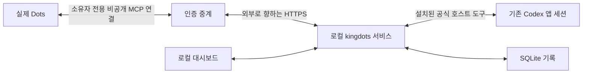

# kingdots

[English](../README.md)

kingdots는 **사용자가 이미 시작한 코딩 세션을 Dots가 조회하도록 연결합니다**. 기존 기록을 모으고 판단·전달 근거를 저장하며 로컬 대시보드로 보여줍니다. 작업 AI에게 감독용 보고서를 작성하거나 Dots에게 알림을 보내게 하지 않습니다.

판단은 Dots가 합니다. PC 서비스는 별도 감독 모델 없이 수집·저장·전달·권한 검사를 담당합니다. 이 개발 프리뷰는 Windows의 기존 Codex 앱 세션에 집중합니다.

## 동작 구조



Dots가 조회를 요청합니다. PC는 요청을 가져와 설치된 공식 도구로 선택된 원래 대화를 읽고 기존 기록을 반환합니다. Dots가 조회와 연결된 지시 없는 판단을 반환하면 같은 서비스가 같은 SQLite DB에 저장합니다. 전송 요청 조회나 수신 기록 저장 자체는 AI 판단을 하거나 Dots를 깨우지 않습니다.

서비스와 대시보드는 loopback에 머뭅니다. 비공개 중계는 PC API 공개 없이 계정을 연결합니다. 현재 경로에는 Dots 계정 플러그인 하나와 PC 서비스 하나가 필요하며 추가 Codex 로컬 관리 플러그인은 필요하지 않습니다.

## 기능과 지원

- 기존 세션을 원래 목표·완료 조건·허용된 후속 지시와 함께 등록합니다.
- 기존 기록과 메타데이터를 조회하고 정상 실행 관찰은 조용히 유지합니다.
- 범위가 정해진 지시·전달 결과·소유권 세대·미확인 결과를 중복 전송 없이 저장합니다.
- 원래 코딩 세션을 보존하며 관리를 일시정지·명시적 재개·해제합니다.
- 대시보드에서 관찰·전달 이유·연결 상태·회수한 판단을 확인합니다.
- 이전 작업 기록을 보존하고 과거 연결 근거를 관리 활성화 없이 이력으로 가져옵니다.

제공자 어댑터는 메타데이터 탐지·목록·조회·종료만 제공합니다. 작업 세션 생성·
제공자 prompt·승인 처리·worktree 생성 코드는 제거했습니다. 저장된 idle·미로딩
메타데이터는 외부 세션의 실제 유휴 상태나 소유권을 입증하지 않습니다.
기존 Codex 앱 호스트의 후속 지시 도구는 별도의 권한 경계를 유지합니다.

| 대상 | 현재 경계 |
| ---- | --------- |
| Codex 앱 | 공식 호스트 도구로 기존 로컬 세션을 조회합니다. 비공개 플러그인은 조회와 지시 없는 판단만 제공합니다. 안전한 실제 지시 전달은 미검증입니다. |
| Codex CLI | App Server로 저장된 메타데이터를 조회합니다. 외부 세션의 소유권과 제어는 미검증입니다. |
| Claude Code | Agent SDK로 저장된 메타데이터를 조회합니다. 외부 세션의 소유권과 제어는 미검증입니다. |
| Claude 앱 | Code·Chat·Cowork의 외부 관찰·제어는 미검증입니다. |
| OpenCode CLI | 버전에 따른 실험 단계 메타데이터 어댑터입니다. 기존 세션 제어는 미검증입니다. |

이전 연결 구현에서 제한된 실제 Dots 조회·판단 반환·최초 응답 종료 후 1회성 재확인은 통과했습니다. 통합 실행 경로에는 통제된 회귀 검사가 있으며 실제 Dots 재시험은 대기 중입니다. 설정 가능한 정기 검토·안전한 실제 개입·5분 대응 목표·미확인 전달 복구·야간 관리는 미검증입니다. 대시보드나 인증된 계정만으로 자동 관리 합격을 선언하지 않습니다. [검증 결과](verification-results.md)를 참고하세요.

## 설치와 실행

Windows·Node.js 24·npm·Git·인증된 기존 Codex 앱 설치를 사용합니다. 다른 OS는 검증하지 않았습니다.

```powershell
git clone https://github.com/OtterHelm/kingdots.git
Set-Location kingdots
npm ci
npm run build
node dist/cli.js start
node dist/cli.js open
```

각 사용자는 위 전제 조건을 갖춘 자신의 PC에 kingdots를 설치하고 실행합니다. 서비스는 실행한 OS 계정의 권한을 사용합니다. `127.0.0.1`은 그 PC 자체를 뜻하는 localhost 주소이며, 서비스는 사용 가능한 포트 하나를 선택합니다. `open`은 해당 설치의 인증된 대시보드를 열며 현재 화면은 한국어 라벨을 사용합니다.

app_host는 기존 Codex 대화 실행기에서 서비스를 시작해 실제 앱 문맥을 상속해야 합니다. 실행 중 서비스는 원래 환경을 유지합니다. status.appHost의 available은 전제 조건 검사이며 실제 조회 성공을 뜻하지 않습니다. [배포 안내](deployment.md)를 참고하세요.

| CLI 명령 | 용도 |
| -------- | ---- |
| start, serve, stop, status | 백그라운드·포그라운드 서비스 실행과 상태 |
| doctor | 어댑터 기능 확인; 앱 호스트 전제 조건은 status에서 별도 표시 |
| open | 인증된 대시보드 |
| mcp | 로컬 stdio 진단; 이것만으로 Dots가 연결되지는 않음 |
| relay-configure | 서비스가 중단된 상태에서 보호된 stdin으로 연결 설정 읽기 |

빌드된 저장소에서는 node dist/cli.js COMMAND를 사용합니다. 로컬 패키지 설치:

```powershell
npm pack
$packageVersion = node -p "require('./package.json').version"
npm install --global ".\kingdots-$packageVersion.tgz"
kingdots start
```

tarball에는 빌드된 서비스·대시보드·중계 배포 소스·문서가 포함됩니다. fixture·임시 실행기·자격증명은 제외됩니다. 이 버전이 npm에 공개됐다고 가정하지 마세요. 패키징은 검증과 빌드를 먼저 실행하며 신뢰된 main CI는 공개나 서비스 교체 없이 검증된 패키지를 로컬에 보관합니다.

업데이트 전에 관리를 일시정지하고 대기·미확인 전달을 확인하세요. 이전 서비스를 중단하고 같은 데이터 폴더로 빌드·설치한 뒤 다시 시작합니다. 일시정지 감시는 그대로 유지됩니다. 이전 연결 기록은 현재 대상과 연결되지 않은 이력으로 한 번 가져옵니다. 명시적인 연결 설정은 감시를 재개하지 않습니다. [업데이트 안내](deployment.md)를 참고하세요.

--data-dir PATH 옵션은 KINGDOTS_HOME과 기본 위치보다 우선합니다. KINGDOTS_PORT는 로컬 포트를 선택하며 없으면 사용 가능한 포트를 선택합니다. 별도 PC OAuth 게이트웨이 리스너는 없습니다.

## 기존 작업 등록과 조회

대시보드나 로컬 MCP에 원래 목표·기존 세션 ID와 프로젝트·조건·허용된 후속 지시를 등록합니다. 적합한 기존 로컬 Codex 대화에는 app_host를 사용하고 정확히 그 대상의 실제 조회를 확인하세요.

```json
{
  "goal": "Observe the existing test repair session",
  "sessions": [{
    "backend": "codex-app",
    "sessionId": "existing-session-id",
    "project": "C:\\projects\\example",
    "source": "app_host"
  }],
  "completionConditions": ["Required tests pass", "Requested artifacts reviewed"],
  "allowedFollowUp": "Routine questions within the original goal; no new sessions, permissions, commit, push or deploy",
  "authorization": {
    "source": "direct_user_request",
    "request": "Observe this existing session within its original scope"
  }
}
```

일시정지·관리 해제는 원래 세션을 중단하지 않고 로컬 관리를 차단합니다. 재개는 사용자 전용 대시보드 제어입니다. 일시정지 감시의 명시적 조회는 관찰·지시·제어 상태를 바꾸지 않습니다. 관리 해제된 감시는 중계에서 조회할 수 없습니다.

로컬 MCP에는 기존 범위 내 후속 지시 기록과 호스트 전달 도구가 남아 있습니다. 비공개 플러그인은 제공하지 않으며 도구가 있다고 실제 Dots 코딩 제어를 입증하지는 않습니다. [로컬 도구 18개와 경계](interfaces.md)를 참고하세요.

## 플러그인과 Dots 연결

소유자 전용 계정 플러그인 하나가 [중계 소스](../relay/README.md)를 통해 inspect_existing_session과 record_no_action_review를 제공합니다. Sites가 계정 OAuth를 제공하며 PC는 제공된 서비스 자격증명과 장치 연결 토큰을 사용합니다. 공개 PC 주소나 모델 API 키는 필요하지 않습니다.

PC 서비스가 중단된 상태에서 신뢰하는 중계 origin과 등록된 세션 하나를 설정합니다. 설정은 보호된 stdin으로 읽고 자격증명은 로컬 비밀 저장소에 보관합니다. [연결 안내](dots-connection.md)에 배포·장치 연결·제한이 있습니다. 기존 비공개 배포와 플러그인을 재사용하세요.

연결 후 실제 Dots에게 맡기는 예:

> kingdots로 내가 선택한 기존 세션을 조회해줘. 기존 기록을 읽고 개입이 필요 없으면 지시 없는 판단을 기록해줘. 작업 AI에게 보고를 요청하거나 다른 세션을 만들거나 권한을 승인하거나 지원되지 않는 지시를 보내지 마.

PC는 Dots가 시작한 요청을 조회하며 작업 AI 보고나 Dots 알림을 보내지 않습니다. 지속적인 검토 예약은 별도 합격 관문입니다. 서명된 로컬 이벤트 outbox는 유지하며 이벤트 전달만으로 Dots가 깨어나 판단했다고 입증하지 않습니다.

## 안전·개인정보·사용량

- 사용자가 세션과 범위를 선택합니다. 저장소 내용·작업 AI 질문·도구 결과는 근거이며 승인이 아닙니다.
- 자격증명·권한 확대·복구 불가능한 작업에는 사용자가 필요합니다. 기존 호스트 권한 검사를 유지합니다.
- 로컬 UI와 MCP는 서로 다른 토큰을 사용하며 인코딩된 별칭도 라우터가 매칭한 경로를 기준으로 검사합니다. 중계 요청·응답 스트림은 바이트 한도를 넘으면 중단합니다.
- 소유권 세대·예약·명령 ID·전달 근거는 kingdots 지시 중복을 막으며 외부 호스트 프로세스를 잠그지는 않습니다.
- 실행 중·권한 대기·미확인·오래된 관찰·사용자 개입은 후속 지시를 차단합니다. 재시작은 관리를 일시정지합니다.
- 불확실한 전달은 보류합니다. 조회 결과 수락 확인을 잃으면 자동 재전송하지 않으며 복구에는 실제 수락 근거가 필요합니다.
- 완료에는 최신 호스트 기반 조건과 근거가 필요합니다. 서비스가 직접 테스트를 실행하거나 원본 파일 해시를 검증하지는 않습니다.

기록은 %LOCALAPPDATA%\kingdots에 저장합니다. 새 폴더가 없으면 이전 %LOCALAPPDATA%\DotsKing 설치를 그대로 사용합니다. KINGDOTS_HOME이나 --data-dir PATH로 변경할 수 있습니다. 서비스와 진단은 같은 폴더를 사용해야 합니다.

kingdots.sqlite에 감시·관찰·지시·중계 요청·회수한 판단을 저장합니다. secrets.bin은 UI·MCP 토큰·callback·중계 자격증명을 현재 사용자 Windows DPAPI로 보호합니다. 이전 별도 파일은 복구용으로 보존하지만 실행 중 DB로 사용하지 않습니다. 가져온 이력에는 현재 세션 권한이 없습니다.

최근 대화 기록은 소유자 전용 호스팅 경계를 통과합니다. 조회·판단은 15분 후 만료되고 다음 요청에서 내용 데이터가 제거되며 명령 ID 흔적은 재실행을 방지합니다. 세션·프로젝트 식별자는 가리지만 대화 속 모든 비밀 제거를 보장하지 않습니다. 자격증명·로컬 기록·인증 URL·로그를 공개하지 마세요. [보안 검토](security-review.md)를 참고하세요.

수집·저장·전달에는 별도 모델을 호출하지 않습니다. 실제 Dots 판단과 작업 AI는 기존 제품 사용량을 소비합니다. 알 수 없는 사용량은 추정하지 않습니다. kingdots는 API 키 생성·크레딧 구매·모델 API 과금 활성화를 하지 않습니다. 호스팅 전제 조건과 이용 조건은 별도로 확인해야 하며 무제한 무료 인프라를 약속하지 않습니다.

## 개발과 로컬 CI

```powershell
npm run typecheck
npm test
npm run build
```

의미 있는 회귀 테스트와 CI는 개발 도구로 유지합니다. 제공자 모델 호출 없이 기존 세션 차단·인증·전달 결과·재실행 방지·이관·중계 상관관계를 검사합니다. 임시 실행기와 이전 작업 생성 테스트는 제거했습니다. [검증](verification.md)·[결과](verification-results.md)·[계획](roadmap.md)을 참고하세요.

신뢰된 main push는 Windows runner에서 설치·두 lockfile의 의존성 취약점·타입·테스트·빌드·패키지를 검사합니다. 비밀과 fixture를 제외하고 깨끗한 빌드로 삭제된 모듈이 dist에 남지 않게 합니다. 검증된 산출물과 결과는 로컬에 보관합니다. [로컬 CI](local-ci.md)를 참고하세요.

## 기여와 문서

npm run dev는 TypeScript 서비스를, npm run dev:web는 Vite를 실행합니다. 핵심 파일은 src/watch.ts(생명주기), src/app-host.ts(호스트 연결), src/relay.ts와 relay/worker/relay.js(전달), src/events.ts(callback), src/store.ts(SQLite), src/tools.ts와 src/server.ts(인터페이스), src/web/(대시보드)입니다.

[이슈](https://github.com/OtterHelm/kingdots/issues)나 범위가 명확한 PR을 보내주세요. 동작 변경에는 문서 갱신이 포함됩니다. [기여 안내](CONTRIBUTING.md)와 [저장소 규칙](https://github.com/OtterHelm/kingdots/blob/main/AGENTS.md)을 참고하세요.

| 문서 | 내용 |
| ---- | ---- |
| [배포](deployment.md) | 설치·설정·패키징·업데이트 |
| [Dots 연결](dots-connection.md) | 연결·전제 조건·제한 |
| [인터페이스](interfaces.md) | 수집 경로·도구·route·계약 |
| [계획](roadmap.md) | 현재 범위·합격 조건 |
| [검증](verification.md) / [결과](verification-results.md) | 검사·날짜별 근거 |
| [로컬 CI](local-ci.md) | Windows runner·로컬 결과 |
| [발견 가능성](discoverability.md) | 검색·홍보 기록 |

## 라이선스

Apache-2.0입니다. [LICENSE](../LICENSE)·[NOTICE](../NOTICE)·[제삼자 고지](third-party-notices.md)를 참고하세요. 제공자 도구·SDK는 자체 약관을 유지합니다. Claude Agent SDK를 이 저장소의 Apache-2.0으로 재라이선스하지 않습니다.
