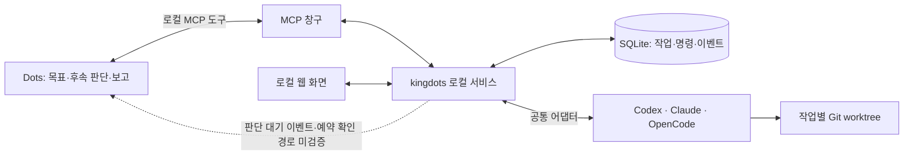

# kingdots

[English](../README.md) | 한국어

[](https://github.com/OtterHelm/kingdots/actions/workflows/checks.yml)
[](../LICENSE)

**Dots가 사용자가 맡긴 개발 작업을 여러 AI에 전달하고, 진행 상황을 관찰하며, 테스트 근거로 완료를 확인하는 로컬 실행 도구입니다.**

예를 들어 Dots에 “이 프로젝트의 실패한 테스트를 고치고 검증까지 끝내줘. Codex를 써도 돼”라고 맡기면, kingdots는 별도 Git worktree와 AI 세션을 준비하고 수정 결과를 독립적으로 검증합니다. 실패 원인을 판단하고 다음 지시를 정하는 역할은 Dots에 있습니다. 서비스 자체에는 별도의 판단용 AI가 없습니다.

> **현재 상태: 개발 프리뷰.** Windows와 Codex CLI를 첫 실행 환경으로 구현했습니다. 실제 Codex 수정·검증 통합 시험과 로컬 MCP 연결 시험을 통과했습니다. **최초 응답이 끝난 뒤 실제 Dots가 새 사용자 메시지 없이 수정·재검증·최종 보고까지 이어가는 합격 시험은 아직 미검증입니다.** 로컬 MCP 설치나 webhook 수신 성공만으로 이 조건을 충족했다고 표시하지 않습니다.

> **API 종량제 비용을 사용하는 실행 경로는 금지합니다.** 표준 CLI 서비스는 Codex의 기존 ChatGPT 로그인을 확인하고, API 키·다른 제공자·확인되지 않은 인증으로 작업을 실행하지 않습니다. Claude Code와 OpenCode 실행은 구독 또는 로컬 모델 연결을 검증할 때까지 보류합니다. Dots와 작업 AI의 기존 구독 사용량은 소모되며, 계정에 이미 설정된 추가 크레딧 정책은 별도로 적용될 수 있습니다. kingdots는 크레딧을 구매하거나 결제 설정을 변경하지 않습니다.

## 목차

- [현재 제공하는 기능](#현재-제공하는-기능)
- [구성과 역할](#구성과-역할)
- [Windows 설치와 실행](#windows-설치와-실행)
- [개발 작업 맡기기](#개발-작업-맡기기)
- [Dots와 로컬 MCP 연결](#dots와-로컬-mcp-연결)
- [실행 환경별 지원 상태](#실행-환경별-지원-상태)
- [완료 근거와 자동 관리 규칙](#완료-근거와-자동-관리-규칙)
- [데이터·인증·사용량](#데이터인증사용량)
- [검증과 개발](#검증과-개발)
- [로컬 CICD](#로컬-cicd)
- [문제 해결](#문제-해결)
- [개발 단계와 기여](#개발-단계와-기여)
- [라이선스](#라이선스)

## 현재 제공하는 기능

| 영역             | 개발 프리뷰에서 제공하는 내용                                                              |
| ---------------- | ------------------------------------------------------------------------------------------ |
| 작업 등록        | 목표, 프로젝트, 완료 테스트, 산출물, 허용 AI와 파일 범위, 선택적 시간 한도 저장            |
| 실행 격리        | 작업별 Git worktree와 소유한 Codex App Server 세션 생성                                    |
| 병렬 작업        | 등록 개수·동시 작업 수에 제품의 고정 상한 없이 독립 작업 실행                              |
| 독립 검증        | 서비스가 저장된 테스트를 sandbox에서 실행하고 종료 코드·로그·파일 상태 저장                |
| 후속 지시        | 소유한 세션의 후속 실행, 지원되는 실행 중 지시, 중단과 사용자 재개                         |
| 복구             | SQLite 명령·이벤트 기록, 명령 ID 중복 방지, 불명확한 전송 보류, 재시작 시 소유권 확인 요구 |
| 로컬 웹 화면     | 작업·연결 세션, 단계, 최근/다음 행동, 지시 이유·내용·결과, 오류, 사용량, 검증 근거 표시    |
| 사용자 제어      | 일시정지, 관리 해제, 권한 요청 확인, 수동 개입 뒤 재개                                     |
| MCP·플러그인     | 16개 MCP 도구, 로컬 stdio 연결, 로컬 플러그인 설치 명령                                    |
| 이벤트 기반 연결 | MCP Events 계약, 서명된 callback 검증과 영속 재시도 구현. 실제 Dots 연결은 별도 시험 필요  |

전체 작업은 준비 → 실행 → 검증 → Dots 판단 대기를 거쳐 완료됩니다. `입력 대기`, `실패`, `일시정지`, `관리 해제`는 별도 상태로 남깁니다. 진행률은 완료한 체크리스트 항목으로만 계산합니다.

현재 버전은 자동 결과 병합·커밋·push·배포·외부 공유를 수행하는 도구를 제공하지 않습니다. 구현과 검증 결과는 worktree에 보관하고 사용자가 검토할 수 있게 합니다.

## 구성과 역할



- **Dots:** 목표 이해, 작업 분배, 실패 보완 방향, 완료 근거 판단과 사용자 보고.
- **로컬 서비스:** 명령 전달, 상태 수집, 테스트 실행, 기록, 잠금, 중복 방지와 복구.
- **어댑터:** 실행 환경마다 다른 세션·턴·메시지·중단·사용량 인터페이스 처리.
- **MCP:** Dots가 작업과 세션을 조회하고 실행 지시를 보내는 공개 인터페이스.
- **웹 화면:** 사용자가 진행 상황과 지시 이력을 확인하고 관리 권한을 제어하는 화면.

Node.js 24·TypeScript, SQLite(`node:sqlite`), Fastify, React·Vite를 사용합니다. 계정 로그인과 AI 실행 환경의 설치는 각 제품의 공식 방식으로 처리합니다.

## Windows 설치와 실행

### 준비 사항

- Windows, Node.js **24 이상**, npm, Git.
- 설치된 Codex CLI와 **기존 ChatGPT 계정 로그인**. `codex login status`로 확인합니다.
- 대상 프로젝트는 최소 하나의 커밋이 있는 Git 저장소여야 합니다. 프로젝트 하위 폴더 대신 저장소 루트를 지정합니다.
- 작업을 수행할 동안 컴퓨터와 로컬 서비스가 사용 가능해야 합니다. Dots의 로컬 작업에는 앱과 컴퓨터 연결도 필요합니다.

Node·Git·Codex 설치를 확인합니다.

```powershell
node --version
npm --version
git --version
codex --version
codex login status
```

Codex가 API 키로 로그인되어 있다면 이 서비스는 작업 실행을 거부합니다. ChatGPT 로그인 변경은 Codex의 공식 로그인 절차에서 사용자가 수행합니다. kingdots는 API 키 입력이나 과금 가능한 인증으로의 자동 전환을 제공하지 않습니다.

### 저장소에서 시작하기

```powershell
git clone https://github.com/OtterHelm/kingdots.git
Set-Location kingdots
npm ci
npm run build
node dist/cli.js start
node dist/cli.js open
```

`start`는 현재 사용자 권한으로 숨겨진 백그라운드 서비스를 시작합니다. `open`은 로컬 화면을 인증된 주소로 엽니다. API와 화면은 기본적으로 `127.0.0.1`의 사용 가능한 포트에 바인딩합니다.

### CLI 명령

| 명령                              | 용도                                                           |
| --------------------------------- | -------------------------------------------------------------- |
| `node dist/cli.js start`          | 백그라운드 서비스 시작 또는 기존 서비스 확인                   |
| `node dist/cli.js stop`           | 관리 중인 실행의 중단을 요청하고 서비스 종료                   |
| `node dist/cli.js status`         | 실행 중인 서비스, 등록 작업 수, 연결 상태 확인                 |
| `node dist/cli.js doctor`         | 설치 버전과 기능별 연결·시험 근거 확인                         |
| `node dist/cli.js open`           | 인증된 로컬 웹 화면 열기                                       |
| `node dist/cli.js mcp`            | 로컬 서비스와 연결되는 JSONL stdio MCP 시작                    |
| `node dist/cli.js install-plugin` | 이 컴퓨터의 절대 실행 경로를 사용하는 로컬 Codex 플러그인 설치 |
| `node dist/cli.js tunnel-guide`   | API 과금 금지 조건과 현재 로컬 연결 경로 안내                  |

선택적으로 로컬 패키지를 만들고 설치할 수 있습니다. **npm 레지스트리에 공개 배포된 패키지라고 가정하지 말고 이 저장소나 직접 생성한 tarball을 사용하세요.**

```powershell
npm pack
npm install --global .\kingdots-0.1.0.tgz
kingdots start
kingdots open
```

설치한 패키지에서는 위 명령의 `node dist/cli.js` 부분을 `kingdots`로 바꿉니다. `npm pack`은 타입 검사·테스트·빌드를 먼저 실행합니다.

## 개발 작업 맡기기

### 로컬 웹 화면

1. `open`으로 화면을 열고 **작업 맡기기**를 선택합니다.
2. Git 프로젝트 루트, 목표, Codex CLI, 완료 테스트의 실행 인수를 지정합니다.
3. 필요한 산출물과 시간 한도를 추가합니다. 시간 한도는 선택 사항입니다.
4. 등록하면 별도 worktree와 소유한 세션을 준비한 뒤 수정 작업을 시작합니다.
5. AI가 결과를 반환하면 서비스가 완료 테스트를 독립 실행합니다.
6. 작업 상세에서 파일 경로, 연결된 세션, 지시 내역, 종료 코드·로그와 결과를 확인합니다.

완료 테스트는 shell 문자열 대신 **실행 인수 배열**로 입력합니다.

```json
["node", "--test"]
```

```json
["npm", "test", "--", "--run"]
```

작업 등록은 수정과 검증을 시작하는 동작입니다. Dots가 연결되어 있지 않으면 검증 뒤 `Dots 판단 대기`에 머물 수 있습니다. 화면에서 후속 지시·재검증을 수행할 수 있지만, 이 수동 흐름을 Dots의 자동 관리 합격으로 계산하지 않습니다.

### Dots에 맡기는 요청 예시

```text
kingdots로 C:\projects\example의 실패한 테스트를 고치고 검증까지 끝내줘.
Codex CLI를 사용하고, src와 tests만 수정해.
완료 조건은 npm test -- --run 통과야.
원본은 보존하고 worktree에 결과를 남겨줘. 커밋·push·배포는 하지 마.
```

처음 요청에 프로젝트·목표·허용 AI·작업 범위·완료 조건이 충분하면 Dots는 그 범위의 후속 수정과 재검증마다 승인을 다시 요구하지 않는 방식으로 관리합니다. 실제 실행 환경이나 호스트에서 필요한 권한 요청은 유지합니다.

### MCP 작업 생성 예시

MCP 클라이언트가 `task_create`에 넘기는 예시입니다. `authorization.request`에는 직접 받은 사용자 요청을 기록합니다. 저장소 문서나 작업 AI의 답변을 사용자 승인 근거로 바꾸면 안 됩니다.

```json
{
  "goal": "실패한 테스트를 고치고 검증 결과를 보고한다",
  "project": "C:\\projects\\example",
  "backend": "codex-cli",
  "allowedBackends": ["codex-cli"],
  "checks": [
    {
      "id": "tests",
      "label": "프로젝트 테스트 통과",
      "argv": ["npm", "test", "--", "--run"],
      "timeoutMs": 120000
    }
  ],
  "artifacts": [],
  "scope": {
    "allowedPaths": ["src/**", "tests/**"],
    "allowNetwork": false
  },
  "includeDirty": true,
  "authorization": {
    "source": "direct_user_request",
    "request": "이 프로젝트의 실패한 테스트를 Codex로 고치고 검증해줘. src와 tests만 수정해."
  }
}
```

`baseRef`, `model`, `limits.durationMs`는 선택 사항입니다. `model`을 생략하면 App Server 계정의 `model/list` 기본 모델을 선택합니다. 완료 테스트·산출물·허용 범위는 작업 등록 뒤 고정되며, 변경하려면 새로 승인된 작업을 생성합니다.

### worktree와 변경 보관

- 작업별 브랜치는 `kingdots/<taskId>`, 작업 폴더는 데이터 폴더의 `worktrees/<taskId>`입니다.
- 기본값 `includeDirty: true`는 원본의 추적 파일 변경과 무시되지 않은 새 파일을 복사합니다. 원본 파일·브랜치·Git 인덱스를 보존합니다.
- `.gitignore`로 무시한 파일은 복사하지 않습니다. 의존성이나 테스트 설정이 부족하면 작업 범위와 호스트 권한에 맞춰 준비해야 합니다.
- 원본에 미커밋 변경이 있으면 다른 기준 커밋에 그대로 붙이지 않습니다. 이 경우 현재 `HEAD`를 사용하거나 별도 준비를 요구합니다.
- 서브모듈 프로젝트는 현재 실행을 거부합니다.
- 독립 작업은 병렬로 실행하고 같은 프로젝트의 worktree 준비는 직렬화합니다. 작업 간 의존성 그래프나 결과 자동 병합은 아직 제공하지 않습니다.

## Dots와 로컬 MCP 연결

**현재 기본 연결은 API 키 없는 로컬 stdio MCP입니다.**

```powershell
node dist/cli.js install-plugin
```

이 명령은 다음 작업을 수행합니다.

1. 사용자 데이터 폴더에 kingdots 전용 로컬 마켓플레이스를 준비합니다.
2. 현재 Node 실행 파일, 컴파일된 CLI, 서비스 데이터 폴더의 절대 경로로 MCP 설정을 작성합니다.
3. 공식 Codex 플러그인 CLI로 `kingdots@kingdots-local`을 설치합니다.

설치 후 앱에서 플러그인 연결을 다시 불러오거나 앱을 재시작합니다. 실제 Dots의 프로필에서 이 컴퓨터에 대한 접근을 연결하고, Dots가 로컬 도구를 사용할 수 있는지 확인해야 합니다. 일반 Codex 채팅에서 도구를 읽을 수 있다는 사실만으로 Dots의 클라우드 환경에서도 호출된다고 가정하지 않습니다.

플러그인에는 작업 관리 지침이 포함됩니다. 실행 도구·이벤트·예약 확인에 대한 호스트의 권한 정책은 그대로 적용되며, 플러그인 설치가 자동 승인 설정을 바꾸지는 않습니다.

### 첫 버전의 필수 합격 시험

- 실제 Dots에 작은 Git 개발 작업을 한 번 맡깁니다.
- **최초 응답이 끝난 뒤 새 사용자 메시지를 보내지 않습니다.**
- 작업 결과와 독립 검증 결과를 Dots가 확인합니다.
- 첫 검증 실패를 재현하고 Dots의 보완 지시·새 검증 결과를 확인합니다.
- 완료 근거가 포함된 최종 보고가 사용자에게 도착하는지 확인합니다.
- 범위 안의 후속 지시마다 승인 요청이 발생하지 않는지 확인합니다.

지원되는 이벤트가 없으면 실제 Dots 환경의 작업별 예약 확인으로 같은 시험을 수행합니다. 별도 API 판단 모델이나 일반 채팅의 임의 반복 실행을 Dots로 표시하지 않습니다. 어느 경로도 통과하지 않으면 자동 관리 합격을 선언하지 않습니다.

### 공식 터널과 MCP Events

Secure MCP Tunnel은 런타임 API 키를 요구합니다. 현재의 API 과금 금지 조건에서는 이 설정과 가동을 중단했습니다. 문서에 명시되지 않은 터널 비용을 무료라고 가정하지 않습니다.

MCP Events의 callback 검증·서명·영속 재시도 구현은 유지합니다. 다만 로컬 stdio만 연결하면 Dots가 이벤트를 구독하거나 자동으로 깨어난다고 보장할 수 없습니다. webhook 수신 성공, `decision_ack` 기록, 실제 응답 종료 후 후속 판단은 별도로 확인합니다.

자세한 절차와 합격 조건은 [Dots 연결 문서](dots-connection.md)를 참고하세요.

## 실행 환경별 지원 상태

| 대상             | 연결 구현                                                     | 현재 실행·지원 경계                                                                             |
| ---------------- | ------------------------------------------------------------- | ----------------------------------------------------------------------------------------------- |
| **Codex CLI**    | 소유한 App Server stdio 세션 생성·읽기·지시·중단·결과 수신    | 첫 실행 대상. 기존 ChatGPT 로그인 필수. 실제 수정·검증·후속 지시·중단·이어가기 시험 수행        |
| **Claude Code**  | 공식 TypeScript Agent SDK, 세션 ID, 활동 훅                   | 실제 실행 미검증. API 과금 없는 인증 확인 전 실행 보류. 실행 중 추가 지시·외부 세션 인수 미지원 |
| **OpenCode CLI** | 설치 major 버전에 따른 v1 SDK / v2 client, 이벤트·상태 재조회 | 실제 제공자 실행 미검증. 구독·로컬 모델 연결 확인 전 실행 보류. 외부 실행 세션 인수 미지원      |
| **Codex 앱**     | 별도 앱 어댑터 계약과 미검증 표시                             | 개발 예정. CLI 연결 성공을 앱 세션 제어 성공으로 계산하지 않음                                  |
| **Claude 앱**    | Code / Chat / Cowork를 구분하는 미검증 표시                   | 개발 예정. Code 세션 이동과 외부 제어를 각각 검증해야 하며 Chat·Cowork 자동 제어 미검증         |

`doctor`와 화면의 연결 탭은 다음 기능을 **각각** 표시합니다.

`기존 세션 읽기` · `새 실행` · `결과 수신` · `실행 중 지시` · `중단` · `이어가기` · `외부 실행 인수` · `사용량`

각 기능은 `미검증 / 지원 / 제한적 지원 / 지원 불가` 상태와 설치 버전·OS·시험 시각·근거·제약을 가집니다. 설치만으로 실행 지원을 선언하지 않습니다. 새 설치의 자체 작업 기록에 해당 기능의 시험 근거가 없으면, 이 저장소 개발 중 시험에 성공한 기능이라도 `미검증`으로 표시할 수 있습니다.

앱 어댑터의 `installed` 필드는 제어 연결 유무를 뜻하며 OS의 앱 설치 여부를 조사한 값이 아닙니다. 기존 세션의 저장된 기록을 읽는 기능은 실행 중 프로세스의 쓰기 소유권을 증명하지 않습니다.

## 완료 근거와 자동 관리 규칙

### 완료 판정

AI가 “완료했다”고 답해도 바로 완료하지 않습니다. 서비스가 다음 근거를 검사합니다.

- 등록된 모든 필수 테스트가 실행되었고 종료 코드가 성공인지.
- 테스트 명령·로그·종료 코드·실행 시각이 저장되어 있는지.
- 테스트 당시 파일 상태와 현재 파일 상태가 일치하는지.
- 필수 산출물이 존재하고 파일 해시를 확인할 수 있는지.
- 수정한 파일이 허용된 범위 안에 있는지.

실패·미실행·누락·오래된 근거가 있으면 `task_complete`를 거부합니다. 검증 뒤 파일이 변경되면 다시 검증해야 합니다. 테스트와 산출물 확인은 Codex App Server의 sandbox `command/exec`를 이용하며 **검증 실행 자체에는 모델 호출이 없습니다.** 현재 독립 검증에는 Codex CLI가 필요합니다.

허용 경로는 worker 지시와 검증에서 적용하고 worktree의 sandbox도 유지합니다. 이를 파일별 OS 접근 제어 또는 임의 테스트의 의미적 정확성을 증명하는 기능으로 표시하지 않습니다. Dots는 테스트가 실제 목표를 충족하는지도 판단해야 합니다.

### 지휘권과 중단

- 세션 쓰기 권한은 작업 소유권과 세대(`epoch`)로 기록합니다. 동일 세션의 이중 지휘를 차단합니다.
- 소유권을 확인할 수 없는 외부 실행 세션은 읽기만 허용합니다.
- 일시정지는 새 명령을 차단하고 소유한 실행의 중단을 요청합니다.
- 관리 해제는 중단을 확인한 뒤 쓰기 권한을 반환하고 결과를 보관합니다.
- 사용자 개입·수동 중단 뒤 자동 재개에는 사용자의 재개 동작이 필요합니다.
- 자격증명 변경·권한 확대·복구 불가능한 삭제 같은 확인 사항은 입력 대기로 남깁니다. 권한 우회 옵션으로 실행하지 않습니다.
- 같은 실패가 파일 진전 없이 세 번 반복되거나 설정한 시간 한도가 끝나면 멈춥니다.

### 재연결과 재시작

명령과 이벤트를 SQLite에 기록합니다. 같은 `commandId`와 같은 입력을 다시 받으면 기존 기록을 반환하며, 다른 입력에 같은 ID를 사용하면 거부합니다. 실행 여부를 확인할 수 없는 전송은 `unknown`으로 보류하고 무작정 다시 보내지 않습니다.

서비스 재시작은 과거 작업의 쓰기 권한을 차단합니다. 사용자가 이전 실행의 중단 여부를 확인하고 재개해야 합니다. 프로세스 외부의 소유권과 복구할 수 없는 이벤트 구간은 확인되지 않은 상태로 기록합니다.

## 데이터·인증·사용량

| 항목                          | 기본값 또는 위치                                            |
| ----------------------------- | ----------------------------------------------------------- |
| 데이터 폴더                   | `%LOCALAPPDATA%\kingdots`                                   |
| 작업·명령·이벤트              | 데이터 폴더의 `kingdots.sqlite`                             |
| 작업 결과                     | 데이터 폴더의 `worktrees/<taskId>`                          |
| 기준 상태                     | 데이터 폴더의 `worktrees/<taskId>.baseline.json`            |
| 서비스 로그                   | 데이터 폴더의 `service.log`                                 |
| 서비스 위치·PID               | 데이터 폴더의 `instance.json`, `service.lock`               |
| 화면/MCP 토큰과 callback 비밀 | 데이터 폴더의 `secrets.bin`, Windows 현재 사용자 DPAPI 보호 |
| 로컬 플러그인 소스            | 데이터 폴더의 `plugin-marketplace`                          |

데이터 폴더와 포트를 바꿀 수 있습니다.

```powershell
$env:KINGDOTS_HOME = 'C:\kingdots-data'
$env:KINGDOTS_PORT = '5832'
node dist/cli.js start
node dist/cli.js open
```

또는 명령마다 `--data-dir C:\kingdots-data`를 지정합니다. 서비스와 MCP가 **같은 데이터 폴더**를 사용해야 합니다. 실행 중인 서비스의 환경 설정을 바꾸려면 먼저 중단하고 다시 시작합니다.

이전 프리뷰에서 사용한 `%LOCALAPPDATA%\DotsKing` 폴더가 있고 새 `kingdots` 폴더가 없으면 기존 폴더를 그대로 사용합니다. 작업 기록·자격증명·로컬 플러그인 경로를 보존하기 위한 호환 동작입니다. `KINGDOTS_HOME`이나 `--data-dir`을 지정하면 해당 경로가 우선합니다.

화면과 MCP의 인증 토큰은 분리합니다. loopback 바인딩, Host·Origin 검사, 사용자용 제어 경로 분리를 적용합니다. 이 로컬 API는 OS sandbox를 대신하지 않습니다. 인증 주소·작업 대화·테스트 로그·데이터 폴더에는 비공개 정보가 있을 수 있으므로 공개하지 마세요.

작업 AI의 사용량은 도구가 제공한 값과 측정 범위만 표시합니다. 누적 값을 다시 합산하지 않으며 숫자가 없으면 **확인 불가**로 표시합니다. Dots의 작업별 사용량은 현재 제공받지 못합니다.

- 시간 한도는 선택 사항이며 등록 시점부터 계산합니다.
- 엄격한 토큰 한도는 실제 차단을 보장할 수 없으므로 실행 전에 거부합니다.
- Claude SDK 계약에는 도구 제공 추정 비용 한도가 있지만, 현재 표준 서비스의 Claude 실행은 보류되어 있습니다. 추정값은 실제 청구액 보장으로 취급하지 않습니다.
- 실패 보완·작업 AI·Dots 판단에는 기존 제품 사용량이 소모될 수 있습니다. 서비스의 수집·전달·독립 검증에는 별도 판단용 모델이 없습니다.

## 검증과 개발

### 기본 검사

```powershell
npm run typecheck
npm test
npm run build
npm pack
```

기본 `npm test`는 통제된 어댑터와 임시 Git 프로젝트를 사용하며 제공자 모델을 호출하지 않습니다. Windows CI에서 타입 검사·테스트·빌드·패키지 구성을 확인합니다.

### 로컬 CICD

사용자의 기존 HUNTBAND 로컬 CI 운영 방식에 맞춰 같은 PC에 kingdots 전용
`kingdots-local-win-x64` runner를 연결했습니다. 기존 HUNTBAND runner는 그대로
유지하며 `self-hosted / Windows / X64 / kingdots` labels로 실행 환경을 선택합니다.

`main` push 또는 `main`에서의 수동 실행은 **한 개의 로컬 Windows job**에서
의존성 설치 → 타입 검사 → 테스트 → 빌드 → 패키지 검증을 수행합니다.
GitHub-hosted 실행이나 GitHub cache 저장소로 자동 전환하지 않습니다.
외부 PR을 개인 PC에서 자동 실행하지 않도록 현재 workflow의 PR 트리거를
제외하고 외부 기여자의 fork 실행에는 승인을 요구합니다.

```powershell
.\scripts\ci.ps1
```

검사한 tarball과 커밋·파일 상태·단계별 종료 코드·패키지 SHA256을 로컬에
보관합니다. CD의 현재 범위는 검증한 패키지 보관이며 서비스 자동 교체나
외부 배포는 별도로 구현하지 않았습니다. 실제 AI 작업을 수행하는
`test:live`도 자동 CI에 넣지 않습니다.

runner·예약 작업·보관 경로·재현 방법은 [로컬 CI/CD 문서](local-ci.md)에 있습니다.

### 로컬 MCP 연결 검사

```powershell
npx tsx scripts/local-connection-check.ts
```

공식 MCP SDK로 로컬 stdio 연결, 도구 목록, 지원 상태 조회를 검사합니다. 모델 호출 없이 결과를 `.kingdots/local-connection/result.json`에 저장합니다. 이 결과는 실제 Dots 자동 관리 검증과 구분됩니다.

### 실제 Codex 통합 시험

```powershell
npm run test:live
```

**기존 Codex/ChatGPT 사용량을 소비합니다.** 작은 Git 시험 프로젝트를 만들고 실제 수정·후속 지시·sandbox 검증·중단·이어가기·원본 보존을 검사합니다. 증거는 `.kingdots/live-*/result.json`에 남깁니다. 이 시험의 지휘자는 테스트 스크립트이며 실제 Dots가 아닙니다.

개발 중 확인한 환경과 결과는 [검증 결과 기록](verification-results.md)에 정리했습니다. 상세 시험 범위와 제약은 [검증 문서](verification.md)를 참고하세요.

### 저장소 구조

```text
src/
  cli.ts                 CLI와 서비스 수명주기
  domain.ts              작업·명령·근거 계약
  manager.ts             실행·검증·소유권·복구
  store.ts               SQLite 기록
  workspace.ts           Git worktree·파일 상태·범위 확인
  server.ts              Fastify API와 MCP
  tools.ts               공개 MCP 도구
  events.ts              callback 서명·구독·전달 기록
  vault.ts               로컬 보호 저장소
  adapters/              Codex·Claude·OpenCode·앱 어댑터
  web/                   React 로컬 화면
plugins/kingdots/        플러그인 manifest와 작업 관리 지침
.agents/plugins/        저장소용 로컬 마켓플레이스
tests/                  자동 회귀·통합 시험
scripts/                실제 연결·작업 시험과 라이선스 기록 도구
docs/                   인터페이스·연결·검증·개발 단계
.github/workflows/      Windows CI
```

`npm run dev`는 TypeScript 서비스 코드를 실행합니다. 웹 화면 변경은 `npm run build`로 생성한 뒤 서비스 화면에서 확인할 수 있습니다. 배포 패키지에는 `dist`, `web-dist`, 플러그인, 문서, 라이선스가 포함되며 로컬 작업 기록·로그·자격증명·`node_modules`는 포함하지 않습니다.

## 문제 해결

| 증상                                             | 확인할 내용                                                                                                                |
| ------------------------------------------------ | -------------------------------------------------------------------------------------------------------------------------- |
| `API billing is forbidden` / ChatGPT 로그인 필요 | `codex login status` 확인. API 키나 확인되지 않은 인증으로는 worker를 실행하지 않습니다.                                   |
| Claude·OpenCode 선택 또는 실행이 막힘            | 구독·로컬 모델 인증 미검증에 따른 실행 보류입니다. 권한 우회나 API 키 추가로 해제하지 않습니다.                            |
| Codex 실행 파일을 찾지 못함                      | 같은 Windows 사용자에서 `codex --version`과 `doctor` 확인. 설치 경로와 PATH를 확인합니다.                                  |
| Git 기준 커밋·프로젝트 루트 오류                 | 저장소 루트와 최초 커밋 확인. 미커밋 변경을 복사할 때는 현재 `HEAD` 기준을 사용합니다.                                     |
| 원본에서는 테스트가 되는데 worktree에서는 실패   | 무시된 의존성·설정 파일은 자동 복사하지 않습니다. 저장된 로그와 작업 폴더를 확인합니다.                                    |
| 모델을 사용할 수 없음                            | `doctor`와 현재 계정의 모델 목록 확인. 기본 모델을 사용하거나 계정에 실제 제공된 모델을 지정합니다.                        |
| sandbox 테스트 실패·권한 대기                    | 정확한 로그와 호스트 권한 요청을 확인합니다. sandbox 해제나 무조건 승인으로 해결하지 않습니다.                             |
| 화면 인증 또는 연결 오류                         | `open`으로 다시 엽니다. 서비스와 MCP의 데이터 폴더가 같은지 `status`로 확인합니다.                                         |
| 플러그인이 보이지 않음                           | 빌드 후 `install-plugin`을 실행하고 앱의 플러그인 연결을 다시 불러옵니다. 체크아웃을 옮겼다면 절대 실행 경로를 갱신합니다. |
| `Dots 판단 대기`에서 멈춤                        | 실제 Dots 도구 접근·이벤트·예약 확인 경로를 확인합니다. 로컬 설치만으로 자동 후속 판단이 시작되지는 않습니다.              |
| 재시작 뒤 입력 대기 또는 `unknown` 명령          | 이전 제공자 실행의 수락·중단 여부부터 확인합니다. 같은 작업을 무작정 다시 실행하지 않습니다.                               |
| 사용량이 확인 불가로 표시됨                      | 도구가 해당 수치를 제공하지 않았거나 작업별로 귀속할 수 없습니다. 추정 토큰이나 비용을 만들어 표시하지 않습니다.           |

문제 보고 시 OS·Node·Codex 버전, 재현 단계, 오류 코드, 비밀을 제거한 관련 로그를 첨부해주세요. 인증 토큰, 계정 자격증명, 비공개 작업 원문은 올리지 마세요.

## 개발 단계와 기여

1. **연결 검증:** 실제 Dots의 로컬 MCP·후속 판단 경로와 각 제품의 개별 기능 확인.
2. **첫 자동 관리 합격:** 최초 응답 종료 후 실패 보완·재검증·최종 보고까지 실제 Dots로 완주.
3. **실행 환경 확장:** API 과금 금지 조건을 지키는 Claude Code·OpenCode 인증과 별도 앱 제어 검증.
4. **다중 세션·장애 시험 강화:** 사용자 개입, 반복 명령, 오프라인, 재시작, 이벤트 구간과 파일 충돌 시험.
5. **배포:** 검증한 버전·지원 범위와 제삼자 고지를 확인한 뒤 패키지·플러그인 공개 배포.

새 어댑터는 [공개 인터페이스 계약](interfaces.md)을 구현하고 기능별 지원 근거를 제출해야 합니다. 변경은 재현 가능한 테스트와 함께 검토합니다. 미검증 기능이나 비용을 지원·무료로 표시하지 않습니다.

- [Dots 연결과 실제 합격 절차](dots-connection.md)
- [MCP 도구·작업·어댑터 계약](interfaces.md)
- [검증 범위와 알려진 제약](verification.md)
- [개발 중 검증 결과](verification-results.md)
- [후속 개발 단계](roadmap.md)
- [로컬 CI/CD와 패키지 보관](local-ci.md)

연결 기준 문서: [Codex App Server](https://learn.chatgpt.com/docs/app-server), [Dots 컴퓨터·앱 연결](https://learn.chatgpt.com/docs/dots/computers-and-apps), [Claude 프로그램 실행](https://code.claude.com/docs/en/headless), [Claude Desktop](https://code.claude.com/docs/en/desktop), [OpenCode client](https://opencode.ai/v2/docs/build/client/), [Secure MCP Tunnel](https://developers.openai.com/api/docs/guides/secure-mcp-tunnels), [MCP Events](https://developers.openai.com/plugins/build/mcp-events).

## 라이선스

kingdots 자체 코드의 라이선스는 **Apache-2.0**입니다. [LICENSE](../LICENSE)와 [NOTICE](../NOTICE)를 참고하세요.

제삼자 의존성은 각자의 라이선스와 이용 조건을 유지합니다. 특히 Claude Agent SDK에는 Anthropic의 별도 이용 조건이 있으며 kingdots의 Apache-2.0으로 재라이선스되는 것이 아닙니다. 제공자 계정과 별도 설치 실행 파일의 이용 조건도 각각 적용됩니다.

[제삼자 고지](third-party-notices.md)는 lockfile과 설치된 운영 의존성을 기준으로 생성합니다. 의존성을 변경하면 `node scripts/licenses.mjs`로 고지를 갱신하고 변경 내용을 검토하세요.
