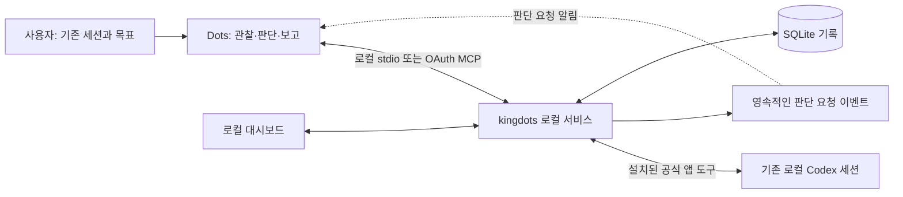

# kingdots

[English](../README.md) | 한국어

[](https://github.com/OtterHelm/kingdots/actions/workflows/checks.yml)
[](../LICENSE)

**Dots가 기존 AI 코딩 세션을 관리하도록 연결하고 기록을 보관하는 로컬 MCP 도구입니다.**

kingdots는 사용자가 잠든 동안을 포함해, 이미 진행 중인 코딩 작업을 Dots에 맡기기 위해 설계했습니다. 사용자가 기존 세션과 목표·허용 후속 지시를 선택하면 Dots가 맥락을 검토하고 같은 세션에 지시하거나 결과를 보고합니다. kingdots는 관찰, 판단 요청 이벤트와 전달 기록을 제공합니다.

**관리와 판단의 주체는 Dots입니다.** kingdots는 관찰을 저장하고 판단을 요청하며 결정·전달 결과를 기록합니다. 별도의 판단 모델을 사용하지 않고 이 작업 흐름에서 새 AI 세션이나 worktree를 만들지 않습니다.

## 설계 의도

코딩 에이전트는 원래 작업을 끝내기 전에 질문, 복구 가능한 오류 또는 응답 종료 지점에서 멈출 수 있습니다. kingdots는 그 맥락을 유지하고 어디에 개입해야 하는지, 무엇이 실제로 전달됐는지 Dots가 확인할 수 있는 기록을 제공합니다.

- **판단은 Dots가 합니다.** 관찰·저장·전달에 별도의 감독 모델을 사용하지 않습니다. Dots와 코딩 세션은 각 제품의 사용량을 사용합니다.
- **선택한 작업을 이어갑니다.** 기존 세션·프로젝트·브랜치·worktree를 유지하며 공개 작업 흐름에서는 대체 세션을 시작하지 않습니다.
- **진행 중인 작업도 먼저 살핍니다.** Dots는 코딩 AI에게 상태 보고서를 요구하지 않고 기존 세션 활동을 판단해야 합니다. 진행 방향을 검토하는 동안 정상 실행은 계속하며, 질문·오류·응답 종료에는 더 빠른 확인이 필요합니다.
- **전달 전에 기록합니다.** 정확한 지시문·이유·관찰·소유권 세대·명령 ID를 보관합니다. 불명확한 전달은 예약을 유지하고 무작정 재시도하지 않습니다.
- **완료에는 근거가 필요합니다.** 대기 상태만으로는 충분하지 않습니다. Dots가 최초 완료 조건마다 최신 테스트·산출물 근거를 검토합니다.

## 구현된 기능

| 기능             | 현재 동작                                                                                                       |
| ---------------- | --------------------------------------------------------------------------------------------------------------- |
| 기존 세션 선택   | 명시적인 세션 ID·프로젝트·원래 목표·완료 조건·허용 후속 지시 등록                                               |
| 관찰             | 등록한 로컬 Codex 앱 세션 조회, Dots가 보고한 호스트 근거 저장 또는 제공자 메타데이터 조회. 판단 모델 호출 없음 |
| Dots에 판단 요청 | 질문·오류·대기/불명확 상태·오래된 관찰 기록, 변경 없는 판단 요청 이벤트 중복 방지                               |
| 후속 지시 기록   | 호스트 전달 전에 Dots의 정확한 지시문·이유·세션·관찰·명령 ID 저장                                               |
| 전달 추적        | 지시를 한 번만 claim하고 호스트의 accepted/not-sent/unknown 결과 보관. 불명확한 전달을 무작정 재전송하지 않음   |
| Codex 앱 연결    | 설치된 공식 앱 도구 서버 사용, 로컬 세션·프로젝트 일치 검사, 전송 직전 대기 상태 재확인                         |
| OAuth 게이트웨이 | 별도 listener, S256 PKCE, 로컬 동의, 선택한 감시별 권한, refresh token 회전과 연결 허용 해제                    |
| 사용자 제어      | 관리 중단·해제·명시적 재개. 원래 작업 세션은 계속 실행                                                          |
| 최종 보고        | 최초 완료 조건마다 최신 대기 상태 관찰과 통과 근거 요구. 호스트가 보고한 근거로 표시                            |

감시나 세션 수에 고정된 제품 제한을 두지 않습니다. 원래 프로젝트 폴더·브랜치·worktree를 유지합니다. 응답 종료나 대기 상태만으로 작업 완료를 판단하지 않으며 진행률을 만들어 표시하지 않습니다.

## 동작 방식



서비스는 TypeScript, Node.js SQLite와 Fastify를 사용합니다. React와 Vite로 대시보드를 빌드하고 MCP SDK로 앱 호스트에 연결합니다. 대시보드·로컬 API와 별도 OAuth 게이트웨이는 두 HTTP listener를 사용해 `127.0.0.1`에 바인딩합니다. 선택적으로 외부 HTTPS proxy가 게이트웨이만 전달할 수 있으며 kingdots가 그 proxy를 구성하지는 않습니다.

| 관찰 `source`        | 조회·전달 경로                                                                                 |
| -------------------- | ---------------------------------------------------------------------------------------------- |
| `app_host`           | kingdots가 등록한 로컬 Codex 앱 세션을 읽고 설치된 공식 앱 도구로 준비된 지시를 전달           |
| `dots_host` (기본값) | Dots가 자체 검증된 호스트 도구로 조회하고 관찰 기록·준비한 지시 claim·전송·수신 결과 기록 수행 |
| `adapter`            | kingdots가 제공자 메타데이터 조회. 저장 이력만으로 실시간 제어를 허용하지 않음                 |

앱 연결에는 실제 Codex executor 문맥과 호환되는 설치 앱 도구가 필요합니다. 대기 상태 확인과 전송은 별도 호스트 호출이므로 다른 호스트 클라이언트와의 원자적 예약을 제공하지 않습니다. `dots_host`에서는 호출자가 자체 검증된 호스트 연결을 제공해야 합니다. 어느 경로에서도 지시 준비 자체는 전송이 아닙니다.

앱 호스트 전송에는 기존 ChatGPT 로그인과 표준 제공자 설정이 필요합니다. API 키·사용자 정의 제공자·불명확한 인증 환경은 차단합니다.

일시정지되거나 관리가 해제된 감시를 명시적으로 조회하면 관리를 재개하거나 관찰 기록을 변경하지 않고 현재 호스트 내용을 반환합니다. 판단 수신 기록은 기존 세션 감시 이벤트를 지원하며, 예전 방식의 작업 AI를 생성하지 않습니다.

`adapter` 대상은 설치된 제공자 어댑터로 조회할 수 있습니다. 저장된 CLI 이력은 외부 프로세스의 대기 상태나 kingdots의 제어권을 증명하지 않으므로 자동 제어에는 `unknown`으로 취급합니다. 서비스는 외부 세션을 별도 프로세스로 동시에 재개하지 않습니다.

## Windows 설치와 실행

지원 배포 환경은 Windows, Node.js 24, npm과 Git입니다. 제공자 도구와 로그인은 이미 준비되어 있어야 하며 플러그인 설치에는 Codex 실행 파일도 필요합니다. 다른 운영체제는 검증하지 않았습니다.

```powershell
git clone https://github.com/OtterHelm/kingdots.git
Set-Location kingdots
npm ci
npm run build
node dist/cli.js start
node dist/cli.js install-plugin
node dist/cli.js open
```

서비스는 현재 사용자의 권한으로 실행하고 `127.0.0.1`의 사용 가능한 포트에 바인딩합니다. `open`은 인증된 로컬 대시보드를 엽니다. 현재 대시보드는 한국어 표시를 사용합니다.

`app_host`에서는 기존 Codex 대화의 executor에서 서비스를 시작해 실제 앱 문맥을 상속해야 합니다. 이미 실행 중인 서비스는 원래 환경을 유지합니다. 대상 등록 전에 `status.appHost`를 확인하세요. `available`은 전제 조건 검사이며 호스트 조회 성공을 뜻하지 않습니다. 자세한 내용은 [배포](deployment.md)를 참고하세요.

| CLI 명령                                  | 용도                                                                  |
| ----------------------------------------- | --------------------------------------------------------------------- |
| `start`, `serve`, `stop`, `status`        | 백그라운드·포그라운드 서비스 실행·중단과 연결 상태                    |
| `doctor`                                  | 제공자 어댑터 지원 범위 확인. 앱 호스트 상태는 `status`에서 별도 확인 |
| `open`                                    | 인증된 대시보드 열기                                                  |
| `mcp`                                     | 로컬 stdio 연결 실행                                                  |
| `install-plugin`                          | 절대 Node·CLI·데이터 경로를 갖춘 로컬 플러그인 갱신                   |
| `gateway-configure --origin HTTPS_ORIGIN` | 별도 OAuth 게이트웨이의 외부 HTTPS origin 설정                        |
| `tunnel-guide`                            | API 키 tunnel 경로가 비활성화된 이유 확인                             |

빌드한 체크아웃에서 `node dist/cli.js <command>`를 사용합니다. 로컬 패키지는 다음과 같이 설치합니다.

```powershell
npm pack
$packageVersion = node -p "require('./package.json').version"
npm install --global ".\kingdots-$packageVersion.tgz"
kingdots start
```

패키지에는 빌드한 서비스·대시보드·플러그인·문서가 포함됩니다. 현재 버전이 npm에 게시되어 있다고 전제하지 않습니다. `npm pack`은 먼저 필수 검사와 빌드를 수행합니다. 신뢰한 `main`의 CI는 검증한 패키지를 로컬에 보관하며 npm 게시·Release 생성·실행 중인 서비스 교체를 자동 수행하지 않습니다.

업그레이드 전에 관리를 중단하고 진행 중·불명확한 전달을 확인합니다. 이전 서비스를 중단하고 같은 데이터 경로로 새 패키지를 빌드·설치한 뒤 플러그인을 갱신하고 연결을 다시 불러옵니다. 재시작한 감시는 명시적 재개와 최신 관찰이 필요합니다. [배포와 업그레이드](deployment.md)를 참고하세요.

`--data-dir PATH`는 `KINGDOTS_HOME`과 기본 데이터 경로보다 우선합니다. `KINGDOTS_PORT`와 `KINGDOTS_GATEWAY_PORT`로 로컬 API·게이트웨이 포트를 선택하며 지정하지 않으면 자동 선택합니다.

## 기존 세션 감시 맡기기

실제 Dots에 요청하는 예시:

> 자는 동안 이 기존 Codex 세션들을 관리해줘: [세션 ID·프로젝트]. 코딩 AI에게 상태 보고서를 쓰게 하지 말고 기존 활동을 15분마다 검토해줘. 원래 목표를 유지하고 범위 안의 질문 응답과 오류 보완을 해줘. 정상 작업은 계속 실행하게 두고 새 세션·권한 변경·커밋·push·배포는 하지 마. 테스트·산출물 근거를 검토하고 결과를 보고해줘.

코딩 세션을 평소처럼 시작한 뒤 기존 ID·프로젝트를 확인하고 원래 목표·완료 조건·허용 후속 지시를 대시보드나 로컬 MCP에 등록합니다. 해당되는 로컬 Codex 앱 세션에는 `app_host`를 사용합니다. 관리를 맡기기 전에 정확히 그 세션을 실제로 읽을 수 있는지와 Dots의 접근을 확인하세요. 연결을 사용할 수 없으면 등록은 저장된 감시 기록입니다.

`watch_create` 입력:

```json
{
  "goal": "자는 동안 기존 테스트 수정 세션 관리",
  "sessions": [
    {
      "backend": "codex-app",
      "sessionId": "existing-session-id",
      "project": "C:\\projects\\example",
      "source": "app_host"
    }
  ],
  "completionConditions": ["필수 프로젝트 테스트 통과", "요청한 산출물 검토"],
  "allowedFollowUp": "원래 목표 안의 질문 응답·오류 보완; 새 세션·권한 변경·커밋·push·배포 금지",
  "authorization": {
    "source": "direct_user_request",
    "request": "자는 동안 이 기존 세션을 원래 범위 안에서 관리해줘"
  }
}
```

대시보드에서도 해당 ID를 등록하고 관찰·판단 이유·전달 기록·최종 보고를 확인할 수 있습니다. 중단·해제는 원래 세션을 중단하지 않고 Dots 관리만 멈춥니다. 재개는 사용자의 대시보드 제어로 수행합니다.

`app_host`에서는 `watch_host_read` → `watch_instruction_prepare` → `watch_instruction_send`를 사용합니다. 서비스가 호스트 상태를 갱신하고 수신 결과를 저장합니다. 수동 claim·receipt 도구는 `dots_host` 경로에 사용합니다. [인터페이스](interfaces.md)에 두 경로를 설명합니다.

## 플러그인과 Dots 연결

플러그인은 관리 스킬과 로컬 MCP 도구 18개를 포함합니다. OAuth 게이트웨이는 PC에서 승인한 기존 감시에 한정된 일부 도구를 공개합니다. [인터페이스](interfaces.md)를 참고하세요.
로컬 stdio에 Platform API 키는 필요하지 않습니다. `install-plugin`은 Codex 로컬 환경에 설치하며 계정 connector 설정은 별도 단계입니다. 호스트 전제 조건·로컬 플러그인 설정·OAuth 경로는 [연결 안내](dots-connection.md)를 참고하세요.

현재는 기존 Codex 세션을 위한 앱 호스트 연결과 CLI 메타데이터 조회에 집중합니다. Dots 계정 연결·자동 관리와 Claude·OpenCode 어댑터는 실험 단계입니다. 정기 내용 검토(계획상 기본 15분, 변경 가능)와 자동 복구는 실제 Dots 왕복 연결이 통과한 뒤 구현합니다. 호환성과 상세 시험 근거는 [검증 결과](verification-results.md)에 보관합니다.

서명된 이벤트 전송 기록은 `task.attention_required`와 `task.completed`를 사용하며 호환성을 위해 `taskId`에 감시 ID를 넣습니다. 구독과 판단 기록은 [인터페이스](interfaces.md)를 참고하세요.

## 안전·개인정보·사용량

- 사용자가 선택한 세션만 등록합니다. 최초 요청이 목표·완료 조건·허용 후속 지시를 정합니다.
- 저장소 내용·작업 세션의 질문·도구 결과는 근거이며 승인이 아닙니다. 자격증명 변경·권한 확대·복구 불가능한 작업에는 사용자 입력을 기다립니다.
- 세션별 전송 예약·소유권 세대·고유 명령 ID·호스트 수신 결과로 kingdots 지시의 중복을 막습니다. 외부 호스트 프로세스를 잠그지는 않으므로 호스트의 실제 제어권과 사용자 개입을 별도로 확인해야 합니다.
- 진행 중인 작업은 그대로 둡니다. 권한 대기·불명확·오래된 관찰에는 일반 후속 지시를 준비할 수 없습니다. 사용자 개입은 이후 지시를 차단합니다.
- 서비스 재시작은 관리를 중단하고 전달 내역 대조를 요구합니다. 불명확한 전달은 실제 호스트 상태로 결과를 확인할 때까지 예약을 유지합니다.
- 완료 보고는 Dots가 근거를 검토한 호스트 보고입니다. 서비스는 조건별 근거와 최신성을 검사하지만 원래 프로젝트에서 테스트를 독립 실행하거나 파일 hash를 검증하지 않습니다. Dots가 실제 테스트·산출물 근거를 검토해야 합니다.

기록은 `%LOCALAPPDATA%\kingdots`에 저장합니다. 새 경로가 없으면 기존 `%LOCALAPPDATA%\DotsKing` 설치를 이전 위치에 유지합니다. `KINGDOTS_HOME`이나 `--data-dir PATH`로 경로를 바꿀 수 있습니다. 서비스와 MCP는 같은 데이터 경로를 사용해야 합니다.

SQLite는 감시·관찰·지시·게이트웨이 인증 기록을 저장합니다. 로컬 UI·MCP 토큰과 callback 비밀값은 현재 사용자의 Windows DPAPI로 보호합니다. OAuth access·refresh token은 hash로 저장합니다. 데이터 경로·인증 URL·원본 로그를 공개하지 마세요. [보안 점검](security-review.md)을 참고하세요.

관찰·저장·전달 기록에는 별도의 판단 모델을 사용하지 않습니다. 실제 Dots 판단과 기존 코딩 세션은 각 제품의 사용량을 소비합니다. 확인할 수 없는 사용량은 확인 불가로 표시합니다. kingdots는 크레딧 구매·API 과금 활성화·API 키 발급을 수행하지 않으며 Secure MCP Tunnel 실행은 비활성화되어 있습니다. OAuth 게이트웨이는 별도 연결 경로입니다.

## 개발과 로컬 CI

```powershell
npm run typecheck
npm test
npm run build
```

통제된 테스트는 등록·판단 요청 중복 방지·오래된 관찰·세션 예약·전달·사용자 개입·재시작·완료 근거를 확인합니다. 제공자 모델 호출 없이 시험 환경을 사용합니다. 시험 절차·결과·출시 기준은 [검증 범위](verification.md), [검증 결과](verification-results.md), [로드맵](roadmap.md)에 있습니다.

신뢰한 `main` push는 로컬 Windows runner에서 설치·타입 검사·테스트·빌드·패키지 검증을 수행합니다. 검증한 패키지와 결과 기록은 로컬에 보관합니다. [로컬 CI](local-ci.md)(한국어), [검증 범위](verification.md), [최소 로드맵](roadmap.md)을 참고하세요.

## 기여와 문서 안내

`npm run dev`는 TypeScript 서비스를, `npm run dev:web`는 로컬 Vite를 실행합니다. 핵심 소스는 `src/watch.ts`(감시 생명주기), `src/app-host.ts`(Codex 연결), `src/gateway*.ts`(OAuth·범위 제한 MCP), `src/events.ts`(callback), `src/store.ts`(SQLite), `src/tools.ts`·`src/server.ts`(인터페이스), `src/web/`(대시보드)입니다.

버그나 설계 제안은 [issue](https://github.com/OtterHelm/kingdots/issues)로, 변경은 집중된 PR로 기여할 수 있습니다. 동작 변경에는 관련 문서 갱신도 포함합니다. [기여 안내](CONTRIBUTING.md), [저장소 작업 지침](https://github.com/OtterHelm/kingdots/blob/main/AGENTS.md)을 참고하세요.

GitHub 프로젝트 설명과 Topics 9개를 적용했습니다. 패키지 메타데이터에도 설명·키워드·README 홈페이지·issue URL을 포함합니다. registry 게시와 커뮤니티 소개는 별도 단계입니다. 적용 내역과 다음 단계는 [검색 노출 기록](discoverability.md)을 참고하세요.

| 문서                                                           | 내용                                          |
| -------------------------------------------------------------- | --------------------------------------------- |
| [배포](deployment.md)                                          | 설치·설정·패키징·업그레이드                   |
| [Dots 연결](dots-connection.md)                                | 연결 경로·호스트 전제 조건·합격 절차          |
| [인터페이스](interfaces.md)                                    | 관찰 source·도구·API·권한 범위·전달 계약      |
| [로드맵](roadmap.md)                                           | 구현된 기반과 남은 출시 관문                  |
| [검증 범위](verification.md) / [결과](verification-results.md) | 시험 범위와 날짜별 근거                       |
| [로컬 CI](local-ci.md)                                         | 신뢰한 Windows runner와 로컬 패키지 결과 기록 |
| [검색 노출](discoverability.md)                                | 검색·홍보 조사와 권장 사항                    |

## 라이선스

Apache-2.0. [LICENSE](../LICENSE), [NOTICE](../NOTICE), [제삼자 고지](third-party-notices.md)를 참고하세요. 제공자 도구와 SDK의 조건은 각각 적용됩니다. Claude Agent SDK를 이 저장소의 Apache-2.0으로 재라이선스하지 않습니다.
