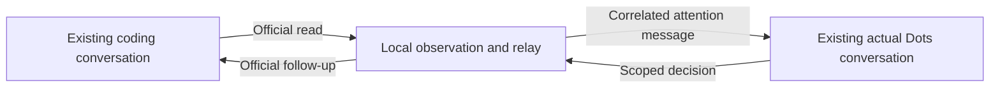

# Overnight supervision validation plan

Decision date: **2026-10-03 (Asia/Seoul)**. This is a validation and delivery plan,
not a claim that unattended supervision already works.

## Locked decisions

The user assigns already-working sessions to actual Dots before sleeping. Dots
observes their context, answers ordinary questions within the original scope,
guides recoverable failures, checks completion evidence and reports the outcome.
kingdots collects, relays and journals; it does not provide a judgment model.

Dots initiates observation of the selected sessions; coding AIs are not asked to
write status reports, send notifications or send their own supervision requests.
Workers must not call supervision tools or run reporting/notification scripts.
Ordinary questions in the original session are observed without asking the worker
to forward them to Dots. The local program
collects existing host state, conversation, activity, errors and verification
records without a model call. Dots judges when intervention is needed and guides
the original sessions. A dashboard and information delivery are intermediate
milestones, not acceptance of the user's proactive supervision requirement.

| Decision              | Agreed scope                                                                                                                                           |
| --------------------- | ------------------------------------------------------------------------------------------------------------------------------------------------------ |
| Current test target   | Existing Windows Codex app conversation                                                                                                                |
| Full support goal     | Codex app, Codex CLI, Claude Code, Claude app and OpenCode CLI; qualify each feature separately                                                        |
| Session continuity    | Keep the original conversation ID and project; safe resumption after the original process demonstrably ends is permitted                               |
| Concurrent ownership  | Never resume the same conversation in a second process while its original owner may still be running                                                   |
| Response objective    | Dots should intervene within five minutes of an ordinary question or recoverable failure; measure actual latency before claiming this objective is met |
| Normal content review | First review on enrollment, then every 15 minutes by default; configurable per watch with a one-minute minimum, including during running work          |
| Running intervention  | Safe additional instructions only for independently verified host capabilities; otherwise wait until the current response ends                         |
| Unexpected recovery   | Reconcile the original session, ownership, user intervention and uncertain commands before automatic continuation; explicit human pauses remain paused |
| Connection preference | Collect, store and control locally; assess a minimal authenticated MCP relay only after the official local round trip is shown unavailable             |
| Usage                 | No paid model API or new API key; existing Dots/coding-product allowances still apply and are not assumed to be unlimited or zero                      |
| Approval              | Original scoped guidance needs no repeated approval; credentials, elevated permissions and irreversible actions remain user decisions                  |
| Existing work         | Preserve the original folders, branches, changes and working sessions; no replacement conversations or supervisor worker                               |

The five-minute objective applies to detecting the need and delivering appropriate
guidance, not to finishing every repair in five minutes. A permission request can
remain blocked for the user while other eligible sessions continue.

## Evidence available

- The existing Codex app conversation was actually read through the installed
  official `codex-app-tools` stdio relay; active-session guidance was blocked.
- The same kind of programmatic relay read the selected Dots engine's metadata
  on its durable host. This does not return its normal user-facing conversation.
- Subsequent bounded probes actually sent two read-only messages to the existing
  actual Dots conversation. Both requested replies appeared in that conversation.
  Native read/wait results did not expose those replies, so the proposed automatic
  decision-return channel has not passed.
- Dots reported a real existing-cloud-task follow-up tool. Its applicability to
  the selected existing local Codex conversation still needs a send test.
- These probes created no conversation, API key or external tunnel. The local
  program makes no model calls; actual Dots replies use the product allowance.
- Dots's earlier native PC probe established a connected, authorized computer,
  but did not establish existing-task control. The earlier cloud read failed with
  `unsupported placement format version 2`; its underlying cause remains unknown.
- The first finite read-only diagnostic expired before the source response ended.
  A subsequent finite trial observed completion, re-read the original local Codex
  conversation and Dots metadata, and received an accepted Dots attention receipt
  after the source reply ended. It did not verify same-session guidance or a
  marker reply within five minutes. Private receipts stay in ignored storage.

The relay requires genuine executor-provided context and depends on the installed
app-tool version. It is not established as a stable standalone background-service
contract. Local reads and accepted Dots messages do not prove a coding-session
write or a complete overnight loop.

## Connection strategies

### Native Dots control

First identify the actual connected computer, selected existing conversation and
currently exposed tool schemas. Use an advertised existing-local-task route;
do not assume a cloud thread route or the caller's `local` host label is the
correct identity in Dots's environment. Record concrete arguments and responses.
Do not repeatedly retry a format error without a discriminating change.

If native Dots read/control and continued coordination pass the user's scenario,
the user does not need kingdots merely to reproduce those capabilities.

Official guidance describes [continuing existing local Codex tasks](https://learn.chatgpt.com/docs/dots/tasks-and-memory)
on a [connected computer](https://learn.chatgpt.com/docs/dots/computers-and-apps).
That guidance does not establish that every existing conversation or account has
the necessary access.

### Existing-app message relay

If Dots does not expose the necessary direct tools, test the installed official
app relay as a minimal alternative:

1. A normal local program observes only enrolled existing coding conversations.
2. When their state needs judgment, it sends a correlated observation to the
   already-existing actual Dots conversation through the official app message tool.
3. Prefer Dots delivering guidance through its own verified existing-task tool,
   with the program checking the original coding conversation for its source,
   correlation and actual result. First test whether the exposed cloud-task tool
   accepts the selected local conversation; do not assume it does.
4. If guidance instead returns through a program-readable channel, the program
   accepts only a decision associated with the expected Dots turn,
   observation, watch, ownership epoch and unpredictable correlation value. It
   delivers that decision to the exact enrolled coding conversation and journals
   the host receipt.

This route has **actual Dots message/reply evidence**, but is not implemented or
verified end-to-end. The tested native Dots read route omitted its user-facing
replies, so it cannot yet supply the proposed automatic return channel. Dots's
own follow-up tool is an alternative still needing local-target verification.
The route may avoid an externally exposed MCP endpoint. Background context,
same-session guidance and correlated completion each need their own real test.
Do not treat arbitrary text in a transcript as a command or user approval. The
original human grant determines targets and scope; Dots's decision cannot broaden
that grant or approve host permissions.

Only ordinary program operations collect observations. Dots is invoked when
judgment is needed, not for every healthy polling interval. No other coding chat
or heartbeat acts as a substitute supervisor.

The previously blocked temporary HTTPS launch is not part of this first route.
Do not retry it through another shell or disable protection. The existing OAuth
gateway remains an experimental fallback requiring its own working deployment
and account-linking evidence; no new external connection is authorized by this plan.

## Gates, in order

| Gate                            | Actual trial                                                                                                                                                             | Required evidence                                                                                                                |
| ------------------------------- | ------------------------------------------------------------------------------------------------------------------------------------------------------------------------ | -------------------------------------------------------------------------------------------------------------------------------- |
| 1. Identify and read            | Match the selected existing Codex conversation and actual Dots conversation to their real hosts; try the eligible native Dots route                                      | Correct IDs/project, recent known content, current state, concrete host errors if rejected                                       |
| 2. Background context           | Let the source response finish naturally; use only the finite read-only program to re-read both conversations                                                            | Source turn completed with final response, successful later reads or a recorded context/lifecycle failure                        |
| 3. Same-session round trip      | Send the previously authorized file-free test once to the selected idle Codex conversation, through the chosen verified route                                            | Host send receipt, original conversation ID retained, expected response in that conversation, no new conversation or file change |
| 4. Actual Dots wake-up          | Let Dots finish its user-visible initial reply; then send one relevant attention event/message or use a supported one-time check-in, with no further human message       | Initial reply delivered, later actual Dots decision, same-session delivery and target response with correlated timestamps        |
| 5. Ordinary question and repair | In one selected existing development task, reproduce an ordinary question, a recoverable failure and failed verification; have Dots guide correction and re-verification | Dots's actual decisions, original session continuity, fresh commands/exit codes/logs/artifacts and final report                  |
| 6. Intervention and recovery    | Test pause, manual user input, uncertain send receipt, disconnected host and safe same-ID resumption after confirmed exit                                                | No stale/new automatic writes after intervention, no blind retry, explicit unknown delivery and preserved evidence               |
| 7. Overnight use                | Observe the selected real Codex work without the user supplying follow-ups; subsequently add the other requested programs                                                | Actual overnight trace, measured response delay, completion evidence and explicit feature limits for every target                |

Gates 1–4 establish connectivity and continuation. A marker reply alone cannot
pass the question/repair or overnight gates. A fixture pass, webhook `2xx`, or a long sleep alone cannot establish a later
actual Dots decision. Verify the subsequent observation, guidance and user-facing
report. A different supervising AI cannot substitute for actual Dots. Internal
turn IDs need not change if the supported Dots runtime continues assigned work.

Do not implement broader dashboards, provider execution or public deployment
before the connection gates have evidence. Failed gates produce a minimal
reproduction identifying the failing host, installed versions, method, sanitized
input and error. A product-side failure must not be disguised by starting a new
conversation or claiming complete support.

## Measuring the five-minute objective

Record the question/failure timestamp when the host supplies it, detection time,
attention delivery, Dots decision and coding-session acceptance. In controlled
trials, use a known trigger time. Report detection-to-action separately when the
original occurrence time cannot be established; do not silently treat it as the
complete five-minute measurement.

Unchanged healthy observations should not trigger extra urgent Dots reviews, but
the agreed regular content reviews still run. Repeated attention and
decisions use stable IDs and persistent cursors. Unknown delivery remains held
until its original host outcome can be verified. Three repeated errors without
progress stop automatic execution and report the reason.

## Full support after Codex acceptance

Maintain independent results for observation, ordinary input, follow-up delivery,
stop, same-ID continuation, usage and recovery. CLI control is not desktop-app
control. Session metadata is not proof that an external owner has stopped.

- **Codex app:** prove the selected native/app relay and actual Dots loop first.
- **Codex CLI:** inspect the installed official session interface and ownership;
  never spawn another writer into a session still owned by the original process.
- **Claude Code:** inspect official session continuation and hooks. Prove a
  compatible existing subscription path before any model run; SDK installation
  does not establish subscription authentication or control of an external CLI.
- **Claude app:** keep Code distinct from ordinary Chat/Cowork. CLI session
  movement does not establish live external control of its desktop owner.
- **OpenCode CLI:** feature-detect the installed server/client interface, preserve
  provider authentication and re-query sessions/messages after event gaps.

Safe resumption is conditional on confirming the original owner has ended and on
retaining the conversation ID, history, working directory, permissions and scope.
Do not terminate a healthy owner merely to make it resumable. Where control is
not available, expose the limitation rather than count the product as supported.

The official [Claude programmatic guide](https://code.claude.com/docs/en/headless)
and [desktop guide](https://code.claude.com/docs/en/desktop) describe separate
interfaces; installed-version and real ownership tests remain necessary.

## Completion of this plan

### Approved implementation order and current gate

The approved implementation starts with one existing Windows Codex app session
and actual Dots. It must establish read access, a program-readable no-action
decision, one same-session marker round trip and post-response continuation
before adding the normal-review scheduler or broadening the dashboard/providers.

The latest actual Dots discovery returned no kingdots read/decision tools and no
local-specific existing-session read tool. The earlier cloud-send trial was
declined for lack of a fresh verifiable target state. Version 0.1.3 repairs local
watch-event acknowledgments and allows explicit paused-watch reads. Those are
connection prerequisites, not a completed automatic supervisor.

After the gate passes, implement `reviewIntervalMs`, one outstanding review per
watch, durable review IDs/epochs/observation references, structured decision
recording and due/late timestamps. Normal running work also requests Dots review;
worker-authored summaries addressed to Dots and worker-to-Dots notifications are
prohibited. Expand host content access as needed
with explicit truncation and source references. Add verified active follow-up
capabilities, fresh command/exit/log/artifact completion checks and recovery
reconciliation next. Then run real unattended acceptance and qualify other products.

An external fallback uses only the isolated OAuth MCP gateway and selected-watch
consent. Confirm destination, access, cost and deployment before linking it.
Do not expose the dashboard, create model API keys, substitute another AI, or
repeat a policy-rejected tunnel launch through another execution path.

The user's actual request succeeds only when actual Dots, after its initial
response ends and without further user messages, manages the selected existing
coding work, handles the allowed questions and errors, checks fresh completion
evidence and reports the outcome. The first acceptance uses Codex app. Full
multi-program support is declared only after each requested target's feature
tests pass.

Update [verification results](verification-results.md), [connection guidance](dots-connection.md),
plugin instructions and both equivalent READMEs when behavior or support changes.
Keep dated experiment details out of README introductions.
